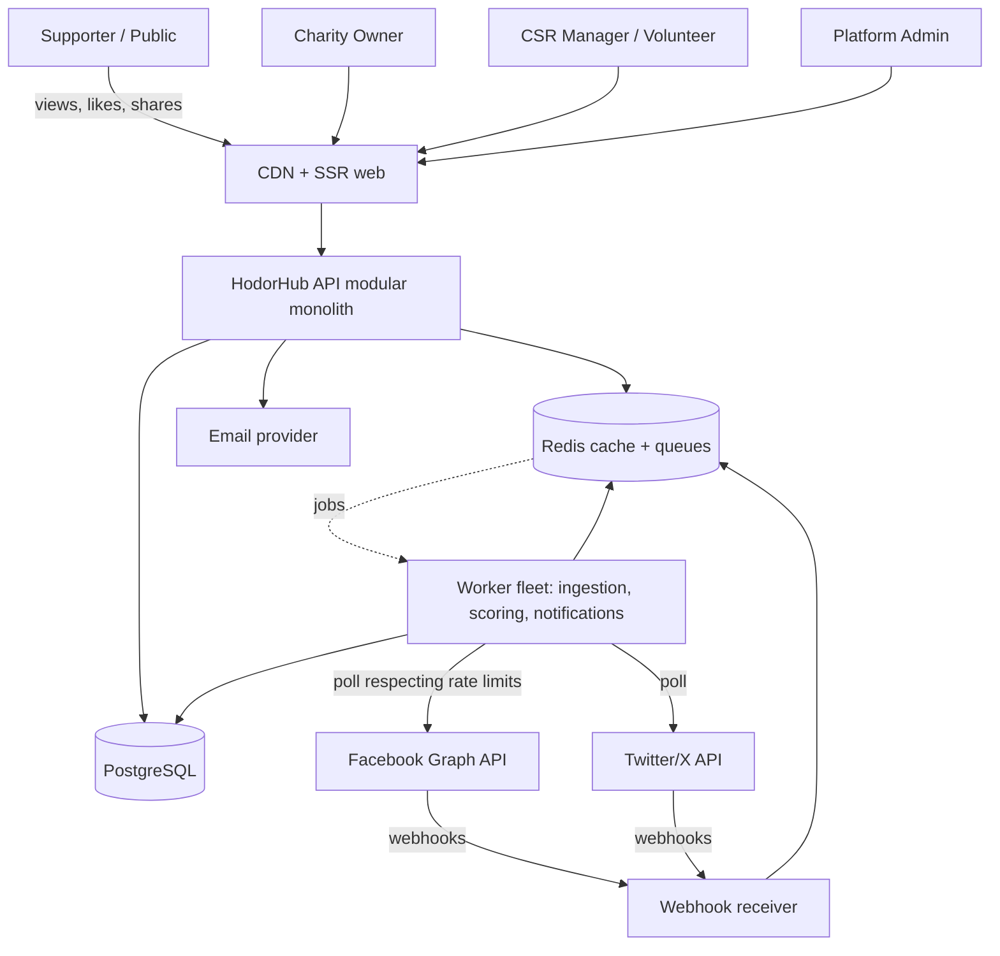
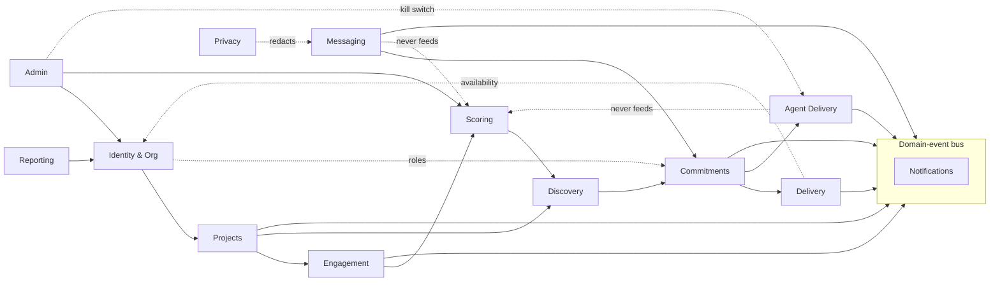
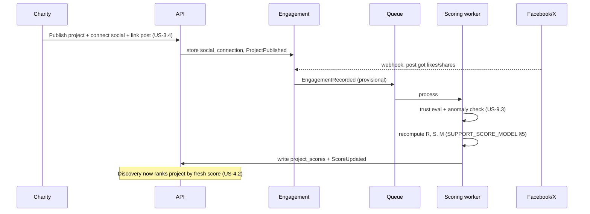
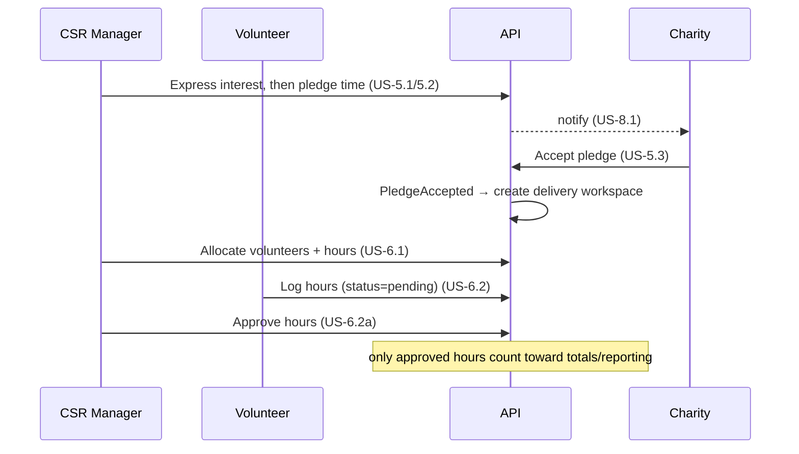

# HodorHub — Technical Architecture (Release 1 / MVP) — draft v0.1

> Scope: the **Release 1** slice from [`PRODUCT_BACKLOG.md`](./PRODUCT_BACKLOG.md) — the core loop *promote → gain real support → attract a corporation → deliver approved donated time*. Implements the scoring defined in [`SUPPORT_SCORE_MODEL.md`](./SUPPORT_SCORE_MODEL.md).
>
> **Stack choices below are a recommendation, not a commitment** — see §4 and the decision at the end. Component boundaries are drawn so individual pieces can be swapped.

## 1. What Release 1 must do (architecturally significant requirements)

| Driver | Consequence for the architecture |
|--------|----------------------------------|
| Public project pages must render rich social preview cards for FB/X scrapers (US-3.1) | **Server-side rendering** + CDN; pages crawlable without JS. |
| Ingest *real* FB/X engagement (US-3.5) | Long-running **background workers**: webhook receivers + schedule-driven pollers, decoupled from request/response. |
| Support score must resist gaming (US-9.3) | A dedicated **scoring + trust pipeline** with provisional→confirmed events and anomaly detection, not inline in request handlers. |
| Multi-tenant: charity orgs + corporation workspaces, roles (US-1.x) | **Org-scoped authorization** as a first-class cross-cutting concern. |
| Corporations may **white-label** with their own logo/theme/domain | Web-tier **tenant resolution + theming**; branding is a gated entitlement; the neutral public marketplace is never brandable. See §3. |
| Employer-approved hours (US-6.2a) | State machine on hour logs; pending vs approved must never be conflated. |
| Everything is event-driven between parties (US-8.1) | Internal **domain-event bus** so notifications & scoring subscribe rather than being called inline. |

## 2. Architecture style

**Modular monolith + worker fleet**, not microservices. One deployable API with strict internal module boundaries (bounded contexts), plus separate worker processes sharing the same codebase for ingestion, scoring, and notifications. Rationale:

- MVP needs clear domain boundaries and fast iteration, **not** the operational cost of distributed services.
- Boundaries (§6) are drawn as they *would* split later, so the seams exist from day one.
- Workers run the same code but a different entrypoint — no premature service extraction, but async work is genuinely off the request path.

## 3. Multi-tenancy & branding

HodorHub is a **hybrid tenancy model**, not siloed multi-tenancy — two deliberately different surfaces:

1. **Shared public marketplace** (`hodorhub.com`) — where charities post, the public discovers and supports, and merit ranking lives. It is cross-tenant *by design* (the whole point is corporations discovering **shared** charity projects), neutral, and always HodorHub-branded. It is **never** white-labelled.
2. **Tenant-branded corporate surfaces** — each corporation is a tenant that may brand **its own** surfaces: the workspace its employees use and, optionally, a public "projects we support" microsite. Branding = logo, colour theme (design tokens), favicon, email templates, and — at Enterprise — a custom domain.

**Data isolation.** Single shared database, **row-level tenancy** keyed by `organisation_id` — not schema- or DB-per-tenant. Siloing data would break the core loop, since a charity project must be discoverable by every corporation. The tenant boundary is an **access + branding** boundary enforced in the authz layer (§10), not a physical partition.

**Tenant resolution (web tier).** Each request resolves to a brand in order: custom domain → subdomain (`company.hodorhub.com`) → authenticated org context → default HodorHub brand. Middleware resolves the brand once per request, injects theme tokens as CSS variables into the SSR output, and serves branding assets from the CDN. Marketplace routes always resolve to the default brand regardless of who is viewing.

**Branding is an entitlement.** Gated by the Billing & Entitlements module (§6): default HodorHub brand on Free/Starter; logo + colour theme at Team; custom domain + full white-label at Enterprise (see [`MONETISATION_MODEL.md`](./MONETISATION_MODEL.md)).

**Custom domains.** Ownership verified via DNS TXT; TLS auto-provisioned (ACM / Let's Encrypt); the SSR tier resolves the tenant from the `Host` header. Subdomains need only a wildcard certificate.

**MVP scope (locked).** Release 1 ships the **entitlement seam** and **tenant/brand-resolution middleware** with the default HodorHub brand only — cheap to build early, painful to retrofit. Corporate logo/theme (Team tier) and custom-domain white-label (Enterprise tier) are **Release 2**.

> **Integrity guardrail (monetisation Principle 3 / US-10.4).** Branding applies *only* to a corporation's own workspace and outward CSR pages. The discovery marketplace, charity project pages, and the support-score ranking stay HodorHub-neutral — no company can brand, reorder, or bias the space where charities and merit live.

## 4. Recommended stack (proposal)

| Layer | Choice | Why / alternatives |
|-------|--------|--------------------|
| Web / SSR | **Next.js (React, TypeScript)** | SSR is a hard requirement for OG/Twitter cards + SEO on public pages. Alt: Remix. |
| API | **Node.js + TypeScript, NestJS** | Shared language with the web tier; module system maps cleanly to bounded contexts; first-class DI for testability. Alt: Fastify (lighter), or a JVM/Go service if that's the org standard. |
| Database | **PostgreSQL** | Transactional core (orgs, pledges, hours) needs relational integrity; `JSONB` covers flexible resource-need shapes; strong aggregate/window functions for scoring. |
| Cache / queue backend | **Redis** | Caches materialised scores, backs rate-limiting, and is the broker for the job queue. |
| Job queue | **BullMQ (Redis)** | Simplest robust option for MVP. Alt: SQS/managed queue if cloud-native preferred. |
| Object storage | **S3-compatible** | Minimal at MVP (org/project images); rich media is Release 3. |
| Transactional email | **Provider (SES / SendGrid)** | For verification and notifications. |
| Auth | **Session-based email/password + email verification**, provider-agnostic | Social *login* is Release 2 (US-3.7). Note: OAuth to FB/X in MVP is **org-level connection for ingestion** (US-3.4), a separate concern from user login. |
| Secrets | **KMS / envelope encryption** | Social OAuth tokens are sensitive and must be encrypted at rest. |

## 5. System context



## 6. Bounded contexts (modules)

Each module owns its tables and exposes an interface to the others; cross-module communication is via published **domain events** (§8) or explicit service calls — never direct table access across modules.



| Module | Owns | Key backlog stories |
|--------|------|---------------------|
| **Identity & Org** | users, organisations (charity/corporation), memberships, roles, verification requests, sessions, **per-org branding config** (§3), **display names + membership profiles (skills/seniority/hours) and the skills registry** | US-1.1, 1.2, 1.3, 1.5 |
| **Projects** | projects, resource needs, lifecycle state machine | US-2.1, 2.2, 2.4 |
| **Engagement** | on-platform supports; social connections (encrypted OAuth tokens); ingested `engagement_events` (provisional/confirmed) | US-3.1–3.5 |
| **Scoring** | trust/anti-gaming evaluation, support & momentum computation, materialised `project_scores` | US-3.5, 9.3 |
| **Discovery** | read model over projects + scores; browse/filter/rank | US-4.1, 4.2 |
| **Commitments** | interest, pledges (resource type/qty/cadence/duration), accept/decline; **resource gifts** (offer/accept/decline/provided/received/withdraw) | US-5.1, 5.2, 5.3, 5.5, 6.5, RG |
| **Delivery** | delivery workspace, volunteer allocations, hour logs + approval state machine; **shared board** — delivery milestones & tasks — and progress against the project goal | US-6.1, 6.2, 6.2a, 6.3, 6.4 |
| **Agent Delivery** *(Epic 11)* | agent-delivery runs, per-run budget ledger (reserve-before-spend), milestone gates, agent-step audit; consumes a funded `compute_pledge` from Commitments | US-11.1–11.12 |
| **Notifications** | notification records, dispatch (in-app + email), **per-user preferences by kind** | US-8.1, 8.2 |
| **Messaging** | `message_threads` + `messages` — one conversation per (project, corporation), tied to the work | US-8.3 |
| **Admin** | verification queue, score-anomaly review, **agent-run kill switch** (US-11.5) | US-1.3, 9.3, 11.5 |
| **Billing & Entitlements** | plans, subscriptions, `hasEntitlement(org, feature)` gating — incl. branding tier (§3) | US-10.1–10.4 |

**Volunteer profiles (US-1.5).** A **display name** is a column on `users`
(person-level, one human one name); **skills, seniority and offered hours** hang
off `membership_profiles`, keyed on the membership, because donated hours are one
employer's hours to donate — so nothing is copied between tenants and releasing a
seat takes that employer's copy with it by `ON DELETE CASCADE`. An **absent row
means *no stated availability*, which is not `0`**, and no read may conflate them.
**Delivery computes over-allocation**, not Identity: Delivery already depends on
Identity, so the arithmetic crossing the line the other way would be a cycle. The
sum is **same-employer only** — a global sum would leak the existence of a second
membership. It **warns, never refuses**: the employer authorises the donation. The
charity's view is unchanged (US-6.3's `Volunteer 1..n`), and none of this data
reaches Scoring or Discovery.

**In-context messaging (US-8.3).** Messaging owns `message_threads` and
`messages` and nothing else. Three rules are structural rather than procedural.
First, a thread's identity is **(project, corporation)** enforced by a unique
index, so "one conversation, the same before, during and after delivery" is a
database rule, and a second corporation on the same project (US-5.4)
necessarily gets its own thread. Second, **the relationship gate lives in
Commitments** — `hasCorporateRelationship` — because Commitments owns all four
signals (interest, pledge, resource gift, compute pledge); computing it inside
Messaging would query four tables it does not own and fork the definition.
Third, a **platform admin gets 404 by the absence of a bypass**: they hold no
membership in either organisation, so the ordinary participation check turns
them away. HodorHub therefore cannot read or moderate these conversations —
that is what the story asks for, and a future "report this thread" flow needs
a consent-based disclosure path, not an admin backdoor. Message text never
enters an event payload: the outbox carries the project title, so private
words are not copied into two more jsonb stores and an email. Messaging is
otherwise a leaf, with one exception: **Privacy calls into it** to redact an
erased author's words, because deleting the rows would gut the *other*
organisation's record of a two-party negotiation and Messaging owns the table.

**The shared delivery board (US-6.3/6.4).** `delivery_milestones` and
`delivery_tasks` hang off the same `delivery_workspaces` row as allocations and
hour logs, and Delivery owns all four. Two rules are structural rather than
procedural. First, **only the charity creates and confirms a milestone** — the
same shape as pending-vs-approved hours (US-6.2a) and provided-vs-received gifts
(US-6.5): the party doing the work never declares the work done, so "every task
is done" is *derived* at read time (`readyToConfirm`) and never stored. Second,
a task's assignee is an `allocations` **row reference**, not a user id, which
makes "the assignee is a volunteer allocated to this workspace" true by
construction. Progress (US-6.4) lives in Delivery rather than Reporting because
three of its four inputs are Delivery's own tables; the fourth, the project
`goal`, comes through the Projects barrel. Agent-delivered work is never folded
into these figures (US-11.9).

`resource_gifts` is a **sibling aggregate to `pledges`** within Commitments — its own
lifecycle (offer → accept/decline → provided → received, plus withdraw), coordination-only
(no delivery workspace is created and project status never moves to `in_delivery`
on a gift's account); it never crosses into Scoring/Discovery (US-RG, §8 above).

**Agent Delivery (Epic 11)** is a bounded context parallel to Delivery — the agent
analogue of human donated-time delivery. Its trigger is a third Commitments sibling
aggregate, **`compute_pledges`** (a corporation's *funded* compute budget; merit-blind
like `resource_gifts`, but with real escrow because HodorHub draws it down). When a
charity accepts a `compute_pledge`, Commitments moves the project to `in_delivery`
(`beginDelivery`) and calls `AgentDelivery.createRunFromPledge` **synchronously in the
same transaction** (a cross-module service call, mirroring `PledgeAccepted → create
delivery workspace`; never a table write). Agent Delivery then owns the run lifecycle:
`agent_delivery_runs`, `run_budgets` + `run_budget_ledger` (reserve-before-spend, §7),
`run_milestones` (the human gate, mirroring the hour-log approval state machine),
and `agent_steps` (token/cost audit — attribution kept **distinct** from `hour_logs`,
never unioned into an "hours" total). It is kept **structurally out of Scoring**: it
imports nothing from Engagement/Scoring/Discovery, references none of their tables, and
emits no event Scoring consumes — enforced by `src/modules/scoring-boundary.test.ts`,
which forbids the run-table names and the `@/modules/agent-delivery` import in the four
scoring/discovery source files (US-11.9, extends US-RG/US-10.4). The orchestrator is
deterministic code (not an LLM); models are reached only through the swappable
`ModelProvider` interface (`src/lib/model-provider.ts`, mirroring `lib/mailer`), which
reports per-call token usage so the budget ledger can meter and halt.

- **Eligible-template allow-list (US-11.12).** `agent-delivery/templates.ts` is the one registry of what agent delivery may attempt: template code, the project categories it is proven to deliver, and the eval evidence for each. The funding zod enum, the funding form and the project page all derive from it. `fundComputeBudget` is the single choke point — `assertTemplateEligible(templateCode, project.category)` → 422 `template_not_eligible`. Acceptance deliberately does not re-check: a pledge that passed the gate must not be stranded by a later registry change. The list is code, not a runtime toggle, so widening it stays a reviewed change carrying eval evidence; admins read it at `GET /api/admin/agent-delivery/templates`.
- **Production promotion (US-11.8).** Going live is a separate, explicit charity-owner approval, split across two processes. `requestProductionPromotion` (web tier) writes a `production` row in `deployed_environments` with status `deploying` and `promoted_by`, and emits `ProductionPromotionRequested`; the relay's second hook enqueues `agent.promote`, and `runProductionPromotion` (worker) performs the deploy with the privileged deployer. Deploy credentials therefore never reach the web tier. The promotion deploys the artifact the charity already approved on staging, is idempotent under retry (it no-ops unless the row is still `deploying`), and marks the row `failed` on error so recovery is another deliberate approval. The agent path (`advanceRun` → `runDeliveryPhase`) can only ever deploy to `staging` — guarded structurally and behaviourally in `promotion-boundary*.test.ts`.
- **Platform brake (US-11.5).** `platform_controls` is a singleton table holding `agent_delivery_paused`, checked in `advanceRun` — the single choke point for every run advance, so one check covers both the relay-driven enqueue and the reconciliation sweep. It is reversible and never fails open: a read error propagates so the worker job retries rather than advancing. An absent row means "never pulled". Per-run control is `setRunStatus` (`paused` is resumable; `halted` is terminal).

## 7. Data model (core tables, indicative)

```
organisations(id, type[charity|corporation], name, reg_number, status[pending|verified|rejected], ...)
users(id, email, password_hash, email_verified_at, ...)
memberships(id, user_id, organisation_id, role[charity_owner|csr_manager|manager|volunteer], ...)
verification_requests(id, organisation_id, status, reviewer_id, reason, ...)
org_branding(organisation_id PK, logo_asset_ref, favicon_ref, theme_tokens[jsonb],
             subdomain, custom_domain, domain_verified_at, branding_status, ...)

plans(id, code, name, ...)
subscriptions(id, organisation_id, plan_id, status, ...)
entitlements(id, organisation_id, feature, limit_value, ...)

projects(id, charity_org_id, title, description, status[draft|published|in_delivery|completed|archived], ...)
project_resource_needs(id, project_id, skill, role, hours_per_week, duration_weeks, kind[ongoing|sprint], ...)

social_connections(id, organisation_id, platform[facebook|twitter], token_ciphertext, linked_post_ref, ...)
engagement_events(id, project_id, source, action, actor_ref, base_weight, trust, effective_value,
                  status[provisional|confirmed|flagged], occurred_at, ingested_at)
on_platform_supports(id, project_id, user_id, created_at)          -- unique (project_id, user_id)
project_scores(project_id PK, support_score, momentum_score, raw_r, last_updated_at)

interests(id, project_id, corporation_org_id, created_at)
pledges(id, project_id, corporation_org_id, resource_type, quantity, cadence, duration_weeks,
        status[proposed|accepted|declined], decided_by, reason, ...)

delivery_workspaces(id, project_id, pledge_id, ...)
allocations(id, delivery_workspace_id, volunteer_user_id, hours_per_week, ...)
hour_logs(id, allocation_id, volunteer_user_id, hours, note, status[pending|approved|rejected],
          approved_by, decided_reason, logged_at)

notifications(id, user_id, type, payload, read_at, created_at)
notification_preferences(id, user_id, kind, in_app, email, updated_at)   -- absent row = platform default
users(… , display_name)                              -- US-1.5; null = fall back to email
membership_profiles(membership_id PK -> memberships ON DELETE CASCADE, weekly_hours, seniority,
                    note, created_at, updated_at)    -- absent row = NO stated availability (not 0)
membership_profile_skills(membership_id, skill_code) -- PK(membership_id, skill_code)
allocations(… )                                      -- + unique(delivery_workspace_id, volunteer_user_id)
message_threads(id, project_id, corporation_org_id, created_at, last_message_at)
                                                    -- unique(project_id, corporation_org_id)
messages(id, thread_id, seq bigserial, author_user_id, author_org_id, body, redacted_at, created_at)
audit_log(id, actor_id, action, entity, entity_id, metadata, created_at)
```

`project_scores` is a **materialised read model** written by the Scoring worker; nothing else writes it. Discovery reads it (cached in Redis) and never recomputes on the request path.

## 8. Eventing & async work

Internal integration uses a **transactional outbox**: a module writes its state change and an event row in the same DB transaction; a relay publishes outbox rows to the queue. Guarantees no lost events and no dual-write inconsistency.

Representative events and their subscribers:

| Event | Emitted by | Subscribers |
|-------|-----------|-------------|
| `ProjectPublished` | Projects | Discovery (index), Notifications |
| `EngagementRecorded`¹ | Engagement | Scoring |
| `ScoreUpdated`¹ | Scoring | Discovery (cache bust), Notifications (trending alerts) |
| `InterestExpressed` / `PledgeProposed` | Commitments | Notifications (→ charity) |
| `PledgeAccepted` | Commitments | Delivery (create workspace), Notifications (→ corporation) |
| `HoursLogged` / `HoursApproved` | Delivery | Notifications |
| `DeliveryTaskAssigned` | Delivery | Notifications (→ the assigned volunteer) |
| `DeliveryMilestoneAchieved` | Delivery | Notifications (→ the delivering corporation) |
| `EngagementAnomalyDetected`¹ | Scoring | Admin (review queue), Notifications |
| `ComputePledgeAccepted` | Commitments | Notifications (→ corporation); *(future)* Billing hold | **never Scoring** |
| `MilestoneApproved` / `MilestoneChangesRequested` / `MilestoneRejected` | Agent Delivery | Notifications | **never Scoring** |
| `RunStatusChanged` (kill switch) | Agent Delivery | Notifications, Admin | **never Scoring** |
| `MessagePosted` | Messaging | Notifications (→ the *other* organisation) | **never Scoring** |
| `VolunteerOverAllocated` | Delivery | Notifications (→ the volunteer alone) | **never Scoring** |

Worker classes: **Ingestion** (webhook intake + rate-limited pollers → `engagement_events` provisional), **Scoring** (trust eval, anomaly detection, hourly momentum-decay recompute), **Notifications** (fan-out to in-app + email — the only outbox consumer currently wired; see below).

¹ Aspirational/Release-2: `EngagementRecorded`, `ScoreUpdated`, and `EngagementAnomalyDetected` are not emitted by the current code and Scoring does not consume the outbox — see the correction below.

**Correction (as-built, not aspirational): Scoring is not an outbox subscriber.** It
is a pure library (`engagement/service.ts`) invoked **synchronously, in-transaction**
by `recomputeProjectScore` over `on_platform_supports` and confirmed
`engagement_events` only — called directly from `supportProject`/`unsupportProject`
and from `confirmPendingEngagement`, inside the same DB transaction as the state
change that triggered it. There is no `EngagementRecorded`/`ScoreUpdated` event and
no queue between Engagement and Scoring today; the `scoring.recompute` pg-boss queue
in `src/worker/index.ts` is a stub reserved for a future hourly decay job. The outbox
relay (`relayOutbox`) dispatches domain events to **Notifications** only. This is why
in-kind resource gifts (US-RG) cannot reach the score: there is no bus a gift event
could ride to Scoring, and Scoring's synchronous recompute reads only
`on_platform_supports` and `engagement_events` — never `resource_gifts`.

**Agent Delivery (Epic 11) eventing.** Agent-delivery runs write their lifecycle
events (`ComputePledgeAccepted`, `Milestone*`, `RunStatusChanged`) to the same
transactional outbox, and **none is consumed by Scoring** — the same structural
guarantee as resource gifts, now also asserted by `scoring-boundary.test.ts`. In the
current foundation slice the orchestrator is driven directly (in-process, on the fake
provider) rather than off the relay, and the relay still fans out to Notifications
only. Wiring the relay to a **second subscriber** (an Agent Delivery worker that
advances a run when a gate is approved) is a deliberate follow-up — see §12.9. The
run tables carry no `EngagementRecorded`-style path into Scoring by construction.

## 9. Two critical flows

### 9.1 Promote → support → score → discover



### 9.2 Interest → pledge → deliver → log → approve



## 10. Cross-cutting concerns

- **AuthZ & tenancy:** every request resolves `(user, organisation, role)` and a resolved brand/tenant (§3); policies enforced per module. A CSR Manager cannot approve another company's hours; only a project's charity owner can accept its pledges. Row-level `organisation_id` scoping is the tenant isolation boundary.
- **Rate limiting / anti-abuse:** Redis-backed limits on like/support and share endpoints feed the anti-gaming layer (US-9.3) alongside the trust pipeline.
- **Secrets:** social OAuth tokens envelope-encrypted; least-privilege scopes; never logged.
- **Idempotency:** ingestion dedupes engagement events by `(platform, external_event_id)` so webhook retries and polling overlap don't double-count.
- **Observability:** structured logs, metrics (ingestion lag, score-recompute duration, queue depth), tracing across API↔workers. Ingestion lag is a first-class SLO — stale scores mislead corporate discovery.
- **Resilience:** on FB/X API failure, serve last-known scores with `last_updated_at` (US-3.5 AC); pollers back off on rate-limit responses.

## 11. Deployment (GCP — [ADR 0002](./docs/adr/0002-cloud-hosting-gcp.md))

Target: **GCP, comfortable tier (~$150–500/mo)**. The container image (`Dockerfile`) is unchanged; it runs on Cloud Run. This realization retires the ADR 0001 deferrals (no backups, env-var key, unmeasured SLOs).

- **Web** — Cloud Run service, autoscale (min 1 warm). TLS + domains via a Global External Application Load Balancer + serverless NEG + Google-managed certs (neutral marketplace + wildcard subdomains). Enterprise custom domains (Release 2) via Cloudflare-for-SaaS or per-domain managed certs.
- **Worker** — separate Cloud Run service, `min-instances=1` (always-on for pg-boss), no external ingress.
- **Migrations** — a Cloud Run **Job** running `dist/migrate.cjs`, gated before each web rollout.
- **Database** — Cloud SQL for PostgreSQL, private IP, automated daily backups + PITR. Regional HA is the documented upgrade to the $500+ tier.
- **Cache / rate-limit** — Memorystore (Redis) Basic; enables autoscaling the web tier past one instance (in-process limiter → Redis-backed). Sessions stay cookie-based.
- **Secrets & keys** — Secret Manager for config; Cloud KMS holds the token-encryption key (`crypto.ts` resolves it at boot — envelope encryption, the ADR 0001 upgrade path realised).
- **Object storage** — GCS bucket.
- **Registry & deploy** — image → Artifact Registry; GitHub Actions authenticates via **Workload Identity Federation** (keyless) and deploys web + worker with `gcloud run deploy`. CI + CodeQL + Dependabot unchanged.
- **Networking** — Serverless VPC connector so Cloud Run reaches Cloud SQL/Memorystore over private IP; least-privilege service account per service.
- **Observability (SLOs now measurable)** — structured logs (pino → Cloud Logging), Cloud Monitoring metrics + alerts on ingestion lag and score-recompute duration (§10), uptime checks on `/api/health`.
- **Environments** — separate `staging` + `prod`, same image promoted.
- **Delivered-app isolation (Epic 11 — [ADR 0003](./docs/adr/0003-agent-delivered-app-isolation.md)):** agent-built apps and all agent code execution run **outside** HodorHub's own Cloud Run project/VPC — a separate, egress-restricted "delivered-apps" project with its own service accounts and **no** path to HodorHub's Cloud SQL/Memorystore/Secret Manager (the single biggest blast-radius risk). Code execution uses microVM/gVisor sandboxes (net-new infra — Cloud Run can't host Firecracker/Kata). Deploy is performed by a privileged **Deployer** (a Cloud Run Job holding deploy creds) that **no agent can invoke**; it fires only on an approved milestone gate, targets a **staging/preview** URL first, and promotes to production only via a separate human-approved gate.
- **Self-host fallback** — the Docker Compose + Caddy stack (ADR 0001) remains valid for local prod-like runs and as a portability escape hatch.

> **Infra realization (locked):** the application choices come from [ADR 0001](./docs/adr/0001-zero-funding-stack.md) (TypeScript, Next.js, modular monolith + worker, Drizzle, pg-boss, in-house auth). **Hosting is now [ADR 0002](./docs/adr/0002-cloud-hosting-gcp.md) — GCP, ~$150–500/mo**, which supersedes ADR 0001's single-VM hosting and closes its deferrals (backups, KMS, observability). The bounded contexts, event bus, materialised score, tenancy, and integrity guardrails above are unchanged across both.

## 12. Open decisions (need product/eng steer)

1. ~~**Cloud & language standard**~~ → **decided (ADR 0001 + ADR 0002):** TypeScript; single Next.js app + one pg-boss worker; hosted on **GCP** (Cloud Run web + always-on worker, Cloud SQL, Memorystore, Secret Manager/KMS, GCS) at the ~$150–500/mo tier. Portable container + retained self-host stack avoid hard lock-in.
2. ~~**Auth build vs buy**~~ → **decided (ADR 0001):** in-house session auth (argon2id + signed httpOnly cookies + CSRF) — no paid provider.
3. ~~**Managed queue vs BullMQ**~~ → **decided (ADR 0001):** **pg-boss** (Postgres-backed) — no Redis at MVP; revisit when horizontal scale is needed.
4. **Score recompute strategy at scale** — incremental per-event is fine for MVP volumes; a windowed/streaming recompute may be needed later. Not an MVP blocker.
5. **PII & platform-ToS retention** — how long we may store ingested engagement/actor data (feeds §7 `engagement_events` retention and §10 secrets).
6. **Tenancy data-isolation** — MVP uses shared-schema, row-level tenancy (decided, §3). A physically-isolated (schema/DB-per-tenant) option for regulated Enterprise customers is a future, separate offering — not MVP.
7. ~~**Branding entry point / MVP scope**~~ → **decided (§3):** MVP ships only the entitlement seam + tenant-resolution middleware (default brand); Team gets subdomain + logo/theme and Enterprise gets custom domain + full white-label, both in Release 2.
8. **Agent-delivery budget denomination & billing** → **decided (Epic 11, [ADR 0003](./docs/adr/0003-agent-delivered-app-isolation.md)):** the funded compute budget is **currency-canonical (integer minor units)** with per-model token→currency rates pinned per run; tokens are recorded per step as audit metadata. Metering (reserve-before-spend ledger + halt) lives in Agent Delivery; real money movement is Billing's (Release 2). The sandbox substrate (Firecracker/Kata/gVisor/managed) and delivered-app isolation granularity are settled in ADR 0003 — the operational choice is a devops decision still to be confirmed.
9. **Agent-delivery orchestration wiring** — the foundation slice drives the orchestrator in-process on a **fake** provider; extending the outbox relay to a **second subscriber** (an Agent Delivery worker that advances a run on gate approval), plus real provider adapters, the microVM sandbox, and the Deployer, are deliberate follow-ups once the foundation is proven. Explicitly out of the first slice, not a blocker for it.
