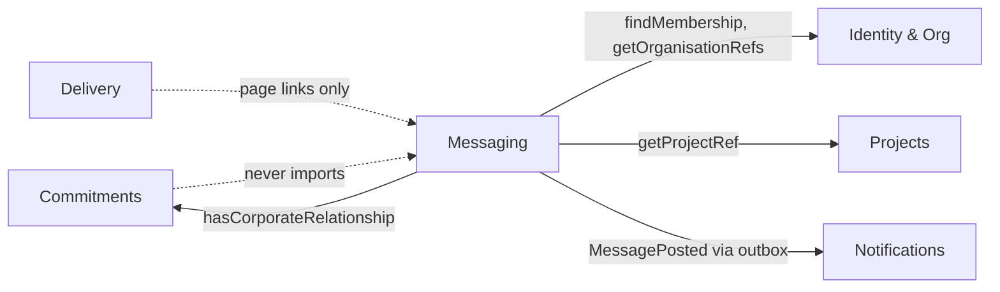
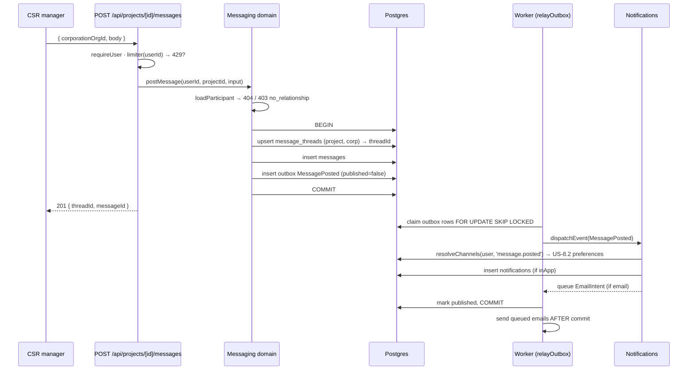

# In-context messaging — design (US-8.3)

*2026-09-04. New bounded context: `src/modules/messaging`.*

Acceptance criteria are already agreed in `PRODUCT_BACKLOG.md` § *US-8.3 In-context
messaging*. This document designs to them; it does not restate or renegotiate them.

---

## 0. Verdict on the proposed shape

The proposal — a new `messaging` context owning two tables, one relationship read on
Commitments, thread identity `(projectId, corporationOrgId)` — is **right, and I would
build it**. Three amendments:

1. **One relationship read is not enough — but two are, and they must share one query.**
   A boolean answers the corporation's "may I post?" but not the charity's "who can I
   talk to?". The charity side needs a *list*, and it does not know the candidate
   corporation ids to loop over. So Commitments exposes `listRelatedCorporationsForProject`
   and a `hasCorporateRelationship` that is **implemented in terms of it** — one
   definition of "relationship", two shapes (US-11.12's one-registry rule).
2. **Messaging needs a second new read that the proposal does not mention:**
   organisation *names*. There is no public Identity read for them today (Discovery
   joins `organisations.name` inline — pre-existing debt, §11.4). Without one, the
   conversation list can only show uuids or Messaging commits the boundary violation
   the whole design is avoiding.
3. **The thread row exists but is never empty.** Explicit row, created lazily inside
   the first `postMessage` transaction — never by a "start conversation" button. An
   empty thread row asserts "there is a conversation here" when nobody has spoken.

Everything else below either justifies or sharpens that shape.

---

## 1. Module boundary, and where the relationship read lives

### 1.1 A new context, not a corner of an existing one



Messaging is a **leaf**. Nothing upstream imports it. That is the whole reason the
US-10.7 module-cycle trap does not bite here, and it is worth being precise about why:

> The US-10.7 lesson is *"do not create a cycle"*, not *"put gates in routes"*. The
> seat gate had to move to the route because enforcing it inside Identity would have
> made **Identity (upstream) import Monetisation (downstream)**. Here the dependency
> runs the correct way — the **new, downstream** module imports the established ones.
> So the relationship gate belongs in the Messaging **domain**, not the route (§4).

Alternatives considered:

| Option | Why rejected |
|---|---|
| Put messaging in **Delivery** | A thread must exist on *interest alone*, before any pledge, and a workspace only exists for an accepted **time** pledge. Gifts and compute pledges never create one. Delivery-scoped messaging is unreachable for three of the four relationship signals the AC names. |
| Put messaging in **Commitments** | Commitments already carries four aggregates with four lifecycles. A conversation is not a commitment; it has no status, no decision, no counterparty approval. Adding a fifth aggregate with an unrelated lifecycle is how a module becomes the place things go when nobody wants a new folder. |
| No new module — a `messages` table read by whoever needs it | This is the shape the reporting boundary test exists to prevent. |

### 1.2 Tables Messaging owns

Exactly two: **`message_threads`** and **`messages`**. It writes `outbox` (every
context that emits events does) and reads **nothing else** directly.

### 1.3 The relationship read belongs in Commitments. Not negotiable.

Commitments owns `interests`, `pledges`, `resource_gifts` and `compute_pledges`. If
Messaging computed the relationship it would query four tables it does not own — a
direct boundary violation and, worse, a **second definition of "this corporation is
involved with this project"** that will drift from the first the moment a fifth signal
is added. New public reads on the Commitments barrel:

```ts
export type RelationshipSignal = 'interest' | 'pledge' | 'resource_gift' | 'compute_pledge';

export interface CorporateRelationship {
  corporationOrgId: string;
  /** Every signal type present, for labelling the conversation ("interested", "delivering"). */
  signals: RelationshipSignal[];
  /** Earliest signal — "talking since". */
  since: Date;
}

/**
 * Every corporation that has any relationship with this project, whatever its status.
 * A cross-module REFERENCE read in the shape of getProjectRef/getPledgeRef: it adds no
 * authorisation of its own, and callers must establish the caller's standing first.
 */
export async function listRelatedCorporationsForProject(
  projectId: string,
  exec?: Executor,
): Promise<CorporateRelationship[]>;

/** The gate. Implemented over the read above — one definition, two shapes. */
export async function hasCorporateRelationship(
  projectId: string,
  corporationOrgId: string,
  exec?: Executor,
): Promise<boolean>;
```

Implementation is four `findMany`s selecting `{ corporationOrgId, createdAt }` merged
in memory. Deliberately not a SQL `UNION` across four tables: the merge is trivial, the
row counts are single digits, and a hand-rolled union query is the thing nobody updates
when a fifth signal lands.

**These reads are unauthenticated by design** — same contract as `getPledgeRef` and
`getProjectSummaries`. That is a loaded gun (who has expressed interest in a project is
currently charity-only information, via `listPledgesForProject`). The mitigation is
ordering: **Messaging establishes the caller's standing before it asks Commitments
anything** (§4.2). The doc comment on the function must say so, in those words.

**Status is ignored — any row counts, including `declined` and `withdrawn`.**
Trade-off, stated plainly:

- *For:* the AC demands "the same thread before, during and after delivery". If a
  declined pledge revoked the relationship, declining would silently strand an existing
  conversation — 404 on a thread both parties could read yesterday. And "why did you
  decline?" is exactly the conversation worth having.
- *Against:* a corporation can force a channel open with one cheap `POST .../interest`.
- *Net:* accepted. Interest is attributable, role-gated to a CSR manager, visible to the
  charity, and posting is rate-limited and (recommended, §11.2) verified-org-gated. The
  alternative — requiring an *accepted* commitment — deletes the pre-pledge conversation
  the first AC bullet explicitly asks for.

---

## 2. Thread identity, uniqueness, and reopen

### 2.1 Explicit row, created lazily on first message

Derived-only (`messages` keyed by `(project_id, corporation_org_id)`, no thread table)
is genuinely cheaper and I considered it. Rejected for three concrete reasons:

1. **"One conversation for that project and that corporation" becomes a database
   constraint instead of a promise repeated in every `WHERE` clause.** A unique index is
   the only version of that guarantee that survives a careless future query.
2. **A stable id for URLs, the notification payload, and pagination cursors.** The
   derived design puts a composite key in every route path and every payload.
3. **Somewhere to hang `last_message_at`** for ordering the charity's conversation
   list, and later `last_read_seq` for unread markers, without a second migration.

Cost, honestly: one extra table, one extra join-ish read, and a get-or-create with a
conflict path. Small, paid once.

### 2.2 The constraint and the get-or-create

```
unique (project_id, corporation_org_id)
```

Get-or-create is a **single statement** inside the `postMessage` transaction:

```
INSERT INTO message_threads (project_id, corporation_org_id, last_message_at)
VALUES (...) 
ON CONFLICT (project_id, corporation_org_id)
DO UPDATE SET last_message_at = now()
RETURNING id
```

`onConflictDoUpdate` rather than `onConflictDoNothing` on purpose: **`DO NOTHING`
returns zero rows on conflict**, which is the classic bug that turns "second person
posts" into a `Cannot read properties of undefined` in production. The `DO UPDATE` also
does real work (touches `last_message_at`), so it is not a contrivance. Two concurrent
first-posts therefore produce one thread and two messages, with no application-level
retry. There is a test for this (§10, t3) and it must use `Promise.all` — awaited
sequentially it proves nothing.

### 2.3 Project reopen / re-pledge — nothing happens, and that is the design

The thread key contains **no pledge id, no workspace id and no lifecycle state**.
Consequences, all of them intended:

- Same corporation re-pledges after a project reopens → **same thread**, history intact.
- A project accumulates several `delivery_workspaces` over time (Delivery already
  handles this in `getDeliveryProgress`) → they all point at the **one** thread for
  that corporation.
- A *different* corporation → a different thread. US-5.4 separation falls out of the
  key rather than being enforced by a filter someone can forget.
- Project `completed` or `archived` → the thread stays readable and postable. Not
  gating on project status is a decision, not an oversight: "after delivery" is in the AC.

`charity_org_id` is **not** stored on the thread. It is derivable from the project via
`getProjectRef`, it can never change, and denormalising it would create a second copy
of a fact Projects owns. `messages.author_org_id`, by contrast, **is** denormalised —
see §3.2.

---

## 3. Data model

Migration `drizzle/0018_*.sql` (drizzle-kit generated from `src/db/schema.ts`).

```
message_threads
  id                  uuid        pk default gen_random_uuid()
  project_id          uuid        not null references projects(id)
  corporation_org_id  uuid        not null references organisations(id)
  created_at          timestamptz not null default now()
  last_message_at     timestamptz not null default now()
  unique (project_id, corporation_org_id)          -- the AC's "one conversation", in the DB
  index  (project_id)                              -- the charity's conversation list

messages
  id              uuid        pk default gen_random_uuid()
  thread_id       uuid        not null references message_threads(id)
  seq             bigserial   not null             -- strict append order; the pagination key
  author_user_id  uuid        not null references users(id)
  author_org_id   uuid        not null references organisations(id)
  body            text        not null
  redacted_at     timestamptz                      -- GDPR tombstone; null = intact
  created_at      timestamptz not null default now()
  index (thread_id, seq)
```

No new enums.

### 3.1 Why `seq bigserial` and not `created_at`

`created_at` defaults to `now()`, which in Postgres is **transaction start time** — two
messages written in one transaction get *byte-identical* timestamps and have no defined
order. Uuid v4 is not a usable tiebreaker (it is random, so "oldest-first" would be
"random-first" among ties). `seq` gives a strict total order, a trivially correct
keyset cursor, and a free foundation for unread markers later.

Two things a future reader will be tempted to "fix" and must not:

- `seq` is **global, not per-thread**, so a thread's values have gaps. Irrelevant: the
  cursor is opaque and only ordering matters.
- Sequence values are assigned at INSERT, so a long-running transaction could commit
  after a later-numbered one. With single-statement appends in short transactions this
  is negligible, and `created_at` has the same hazard in a worse form.

### 3.2 Why `author_org_id` is denormalised

Attribution must be a **fact of the message at the time it was written**, not re-derived
from a `memberships` row that can be deleted (US-10.7 `removeMember` exists) or changed.
Re-deriving would silently rewrite history: "who said this" would change when someone
leaves the company. This is the correct kind of denormalisation.

### 3.3 GDPR erasure — a gap this slice must close

`src/modules/privacy/service.ts` line 42 already says, in the code:

> *"Every user-scoped table belongs here. When a new one is added (US-8.2 added this;
> **US-8.3 will add messages**), it must be swept too."*

But a straight `DELETE` is wrong here: it would gut the *other* organisation's record of
a two-party negotiation. Proposal, matching the existing "retained but no longer tied to
identifiable personal data" policy:

```
UPDATE messages SET body = '', redacted_at = now() WHERE author_user_id = $1
```

The row, ordering, org attribution and timestamps survive; the person's words do not.
`redacted_at` exists specifically so the UI branches on a **column**, not on a magic
body string — magic-string comparison is precisely the drift this codebase keeps
removing. `author_user_id` still points at the `users` row, which `eraseUser` already
anonymises, so no identifier survives.

---

## 4. Authorisation

### 4.1 Who, exactly

| Actor | `GET` thread | `POST` message |
|---|---|---|
| `charity_owner` of the project's charity | ✅ | ✅ |
| `csr_manager` of a corporation **with** a relationship | ✅ | ✅ |
| `csr_manager` of a corporation **without** a relationship | **403** `no_relationship` | **403** `no_relationship` |
| Any other member of either org (`manager`, `volunteer`) | **404** | **404** |
| An allocated volunteer on the delivery workspace | **404** | **404** |
| Another charity's owner, another corporation's CSR manager | **404** | **404** |
| **Platform admin** | **404** | **404** |
| Anonymous | 401 | 401 |

**Roles are deliberately narrow.** The AC names Charity Owner and CSR Manager and
nobody else, and these threads can carry pledge negotiation. An allocated volunteer
seeing their employer's commercial conversation with the charity is a leak nobody asked
for. Widening later is a one-line change; narrowing after people have read each other's
messages is not. Ship narrow.

**403 vs 404 for "no relationship".** The AC's 404 requirement is about *outsiders*
("visible to both organisations — and to nobody else, including a platform admin").
A CSR manager asking about their *own* corporation's conversation on a *public* project
learns nothing from a 403 that they did not already know, and 403 lets the UI render the
actionable prompt ("express interest, pledge, offer a gift or fund a compute budget to
start a conversation"). So: **403 with a new domain code `no_relationship`**, one line
added to `DOMAIN_STATUS` in `src/lib/http.ts`. Distinct codes are already the house
style (`preference_locked`, `seat_limit_reached`, `template_not_eligible`).

### 4.2 Where each check runs

**All of it in the domain**, in one helper per entry shape. The route does
`requireUser()`, the rate-limit call, zod, and error→status mapping. Nothing else.

```ts
interface ThreadParticipant {
  projectId: string;
  projectTitle: string;
  charityOrgId: string;
  corporationOrgId: string;
  side: 'charity' | 'corporation';
  actingOrgId: string;
}

// Entry by (project, corporation) — the post path and the project page.
async function loadParticipant(
  exec: Executor, userId: string, projectId: string, corporationOrgId: string,
): Promise<ThreadParticipant>;

// Entry by thread id — the read path.
async function loadParticipantByThread(
  exec: Executor, userId: string, threadId: string,
): Promise<ThreadParticipant & { threadId: string }>;
```

Check order inside `loadParticipant`, which matters for leaks:

1. `getProjectRef(projectId)` → `NotFoundError('Conversation')` if absent.
2. `findMembership(userId, project.charityOrgId)` → if present and role is
   `charity_owner`, side = charity. If present with any other role → **404**.
3. Otherwise `findMembership(userId, corporationOrgId)` → if present and role is
   `csr_manager`, side = corporation. Any other role, or absent → **404**.
4. **Only now** ask Commitments: `hasCorporateRelationship(projectId, corporationOrgId)`
   → false → `ForbiddenError` with code `no_relationship`.
5. *(Recommended, §11.2)* `assertOrganisationVerified(corporationOrgId)` on the **post**
   path only.

Step 4 is last on purpose: a stranger never reaches a Commitments read at all, so the
unauthenticated relationship read (§1.3) is never a disclosure surface.

### 4.3 Platform admin gets 404 — enforced by the *absence* of a bypass

There is no admin branch to bypass. A platform admin holds no `memberships` row in
either organisation, so step 2 and step 3 both miss and `loadParticipant` throws
`NotFoundError` — the same object, with the same message, as any other outsider. This is
the `findWorkspaceForParticipant` / `loadParticipant` shape from US-6.3, and it is
stronger than an explicit `if (isPlatformAdmin) throw` because there is nothing to get
wrong.

To keep it that way, three structural commitments:

- **No `/api/admin/...` route touches threads or messages in this slice.**
- **No Messaging function takes an `isPlatformAdmin` or `bypass` flag.** Ever.
- The 404 test asserts the **exact message** (`'Conversation not found.'`), because the
  US-6.3 drive found this precise test passing *vacuously* — an outsider was being
  rejected by a downstream `listMembers` raising its own `NotFoundError`, not by the
  participation check at all.

A platform admin who *is also* a member of one of the orgs sees the thread. That is
membership, not admin, and it is correct.

**Consequence, stated rather than buried:** HodorHub cannot read or moderate these
conversations. US-9.1/9.2 moderation does not reach them. That is what the AC asks for,
and it is a real trust-vs-safety trade the product owner should acknowledge (§11.5).

---

## 5. Notification

### 5.1 Through the outbox, like everything else

`postMessage` writes the thread upsert, the message row, and one `outbox` row in **one
transaction**. Nothing calls Notifications inline. Two reasons, neither stylistic: an
inline call is the dual-write the outbox exists to eliminate, and it would make Messaging
import Notifications — coupling a write path to a delivery mechanism it should not know
about.



### 5.2 Event contract

```
eventType: 'MessagePosted'
payload: {
  messageId:          string,
  threadId:           string,
  projectId:          string,
  title:              string,   // the PROJECT title — public data, used by the copy map
  charityOrgId:       string,
  corporationOrgId:   string,
  authorUserId:       string,
  authorOrgId:        string,
}
```

Every field the consumer needs to pick recipients is **on the payload**, so
`dispatchEvent` resolves `recipientOrgId = authorOrgId === charityOrgId ? corporationOrgId
: charityOrgId` and the matching role, and touches only `memberships` — the documented
lightweight-read exception it already relies on. It never reads a Messaging table.

### 5.3 Message text does NOT go in the payload. Say it plainly.

`NOTIFICATION_COPY['message.posted']` currently renders `p.preview` when present. **We
will never send `preview`, and the `preview` branch should be deleted in this slice.**

Three reasons, in order of seriousness:

1. **It creates a second, unmanaged copy of private user content in another module's
   table.** `notifications.payload` is jsonb with its own lifetime; so is
   `outbox.payload`, which is retained after publish. Erasure (§3.3) and any future
   redaction would have to sweep two more tables in two more contexts to stay honest —
   and the first time someone forgets, redacted words are still sitting in a payload.
2. **It escapes the boundary the AC draws.** `create()` feeds `copy.body(payload)`
   straight into the email text. The AC says the message is visible to both
   organisations *and nobody else*; email is a third channel, delivered to whatever
   address is on file, through a mailer that is a documented no-op/log in production
   (TECH_DEBT). "Visible to both organisations" and "emailed in plaintext" are not the
   same promise.
3. **A preview is a poor notification anyway** — the first 80 characters of a business
   message are usually "Hi Petra, thanks for getting back to us".

So the payload carries the **project title** (already public on the project page) and
the copy becomes:

```ts
'message.posted': {
  title: 'A new message on a project',
  body: (p) => `${titleOf(p, 'A project')} has a new message. Open the conversation to read it.`,
},
```

`titleOf` already exists in `copy.ts`. Deleting the `preview` branch is a deliberate
edit to a US-8.2 file: dead permissive code is exactly how the leak gets added later by
someone "finishing" it. A test asserts no substring of the body reaches the outbox
payload, the notification payload, or the email (§10, t18).

### 5.4 Who is notified

**Every member of the counterpart organisation holding the reading role**
(`charity_owner` on the charity side, `csr_manager` on the corporation side), the author
excluded. Not the author's own colleagues — the AC says "the other side is notified",
and a ping because a teammate sent a message is noise.

This diverges from every other event in `dispatchEvent`, which uses
`orgMember(...)` → `findFirst`, notifying exactly one role-holder. For a decision
("your pledge was accepted") one decision-maker is defensible. For a **conversation**
it is not: with two CSR managers, one of them can read the thread but is never told a
reply exists. So Messaging's case adds a local `orgMembers(exec, orgId, role): string[]`
helper in `notifications/service.ts` and loops `create()` — preferences are applied
per-user inside `create()`, so US-8.2 is honoured for each recipient independently.

> **Latent issue, logged not fixed:** `orgMember`'s `findFirst` means every other
> notification type silently reaches only one role-holder. Real for `pledge.accepted`
> and `resource_gift.*`. Out of scope here; worth a ticket.

Idempotency: the relay marks each outbox row published in the same transaction as the
dispatch, so `MessagePosted` cannot be re-delivered. `create()` needs no idempotency key.

Kind routing: `message.posted` is already in the `messages` kind
(`preferences.ts`, non-essential, defaults `{ inApp: true, email: true }`), so
`resolveChannels` works with no registry change. Nothing in `preferences.ts` changes.

---

## 6. Rate limiting

**10 messages per 60 seconds, keyed on `session.userId`, enforced in the route**
`src/app/api/projects/[id]/messages/route.ts`:

```ts
// US-8.3 — 10 messages / minute / user. An unmetered write that notifies
// someone else is a spam vector.
const limiter = createRateLimiter(10, 60_000);
...
enforceLimit(limiter(session.userId));
```

**Keyed on the user, not the IP.** Login and registration key on IP because the caller
is anonymous; here they are authenticated, and the user id is both stronger and
unspoofable. It also matters that our users are literally corporate employees: an IP key
would put an entire company behind one NAT into a shared bucket and rate-limit a whole
CSR team because one person is typing fast.

**Keyed on the user, not `user:thread`.** The protected resource is "notifications this
human can generate", which is per-human. A per-thread key lets one account send
10 × (number of threads) per minute.

10/min is ~1 every six seconds — far above real prose cadence, far below spam volume.

**In the route, not the domain**, for three reasons:

1. `createRateLimiter` is module-level mutable state. Put it in the domain and the
   worker, the seeds and every integration test share one bucket — tests would start
   failing based on execution order.
2. 429 is an HTTP concept. The domain throws `DomainError`s; `HttpError` lives in
   `lib/http`, which no module imports.
3. It is the established pattern (login 10/min, register 5/min, support 30/min).

Trade-off accepted: a future second write entry point would need its own `enforceLimit`
call. Mitigated by there being exactly **one** write path by design, and a test asserting
the 429 (§10, t21–t23).

**Honest limitation:** the limiter is per-instance (TECH_DEBT H1). With the web tier
autoscaled to N instances the effective ceiling is 10N/min. Already tracked; the Redis
version is the horizontal-scale fix. Do not pretend otherwise in the AC verification.

A separate, complementary control: `body` is `z.string().trim().min(1).max(4000)`,
parsed **in the domain** (like every other module's schema), so payload size is bounded
regardless of which caller shows up.

---

## 7. API surface and read model

### 7.1 Routes

| Method + path | Purpose | Codes |
|---|---|---|
| `GET /api/projects/[id]/conversations` | The conversations the caller may see on this project | 200 (possibly `[]`), 401, 404 unknown project |
| `POST /api/projects/[id]/messages` | Post — get-or-create thread + insert | **201**, 400 (zod), 401, **403** `no_relationship`, **404** non-participant, **429** |
| `GET /api/threads/[id]` | One thread's messages, paginated | 200, 401, **404** (unknown thread *or* not a participant *or* platform admin — byte-identical response) |

**There is deliberately no `POST /api/threads` and no thread-id-scoped write.** Posting
is addressed by `(projectId, corporationOrgId)` because that is the thread's real
identity; the id is an implementation detail the caller does not need in order to speak.
This gives exactly one write path (trivial to rate-limit and to audit) and makes empty
threads impossible.

`corporationOrgId` is **required in the body even for a corporation caller**, and must
equal an org the caller is a `csr_manager` of, or they get 404. Deriving it server-side
from "the caller's single membership" would be a hidden dependency on
`getUserOrg`'s one-membership assumption; requiring it is explicit and symmetric with
`/interest` and `/pledges`, which already take `corporationOrgId`.

`GET .../conversations` returns **200 with `[]`** rather than 403/404 for someone with
no conversations. It is a "what is mine" endpoint; an empty list is the truthful answer
and leaks nothing. The AC's 404 requirement concerns thread *contents*, which this
endpoint never returns.

### 7.2 Public surface of the Messaging barrel

```ts
// src/modules/messaging/index.ts
export {
  postMessage,
  getThread,
  listConversationsForProject,
  messageSchema,
  type MessageInput,
  type ConversationSummary,
  type ThreadView,
  type MessageView,
} from './service';
```

```ts
export const messageSchema = z.object({
  corporationOrgId: z.string().uuid(),
  body: z.string().trim().min(1).max(4000),
});

export async function postMessage(
  actingUserId: string,
  projectId: string,
  input: MessageInput,
  db?: Db,
): Promise<{ threadId: string; messageId: string }>;

export async function getThread(
  actingUserId: string,
  threadId: string,
  opts?: { limit?: number; before?: number },   // before = a seq cursor
  db?: Db,
): Promise<ThreadView>;

/**
 * Charity owner: one entry per related corporation. CSR manager: at most their own.
 * Anyone else: []. Never throws for a non-participant, so any page may call it —
 * the same contract as Delivery's findWorkspaceForParticipant.
 */
export async function listConversationsForProject(
  actingUserId: string,
  projectId: string,
  db?: Db,
): Promise<ConversationSummary[]>;
```

### 7.3 Read model

```ts
interface ConversationSummary {
  /** null until the first message — the thread row does not exist yet. */
  threadId: string | null;
  corporationOrgId: string;
  corporationName: string;
  signals: RelationshipSignal[];      // for the "interested" / "delivering" chip
  lastMessageAt: Date | null;
  messageCount: number;
  canPost: boolean;
}

interface ThreadView {
  threadId: string;
  project: { id: string; title: string };
  charityOrgName: string;
  corporationOrgId: string;
  corporationName: string;
  viewer: { side: 'charity' | 'corporation'; organisationId: string; canPost: boolean };
  /** The window, ALWAYS oldest-first (see §8). */
  messages: MessageView[];
  /** Older messages exist above this window. */
  hasMore: boolean;
  /** Cursor to pass as `before` for the previous page; null when hasMore is false. */
  nextBefore: number | null;
}

interface MessageView {
  id: string;
  body: string;              // '' when redacted
  redacted: boolean;
  authorOrgId: string;
  authorOrgName: string;
  authorLabel: string;       // see below
  isMine: boolean;           // this viewer wrote it
  isMySide: boolean;         // this viewer's organisation wrote it
  postedAt: Date;
}
```

`viewer.canPost` exists so the UI never renders a composer the domain would refuse —
the same discipline as `getWorkspaceBoard`'s `viewer` block.

**Author identity disclosure — a deliberate divergence from US-6.3.** The delivery board
withholds the corporation's roster from the charity (`Volunteer 1..n`), because a
corporation's employee list is not the charity's data. Messaging does the opposite:
`authorLabel` is the author's **email** (there is no name field until US-1.5), shown to
both sides. The disclosure is much narrower than a roster — only people who have
*chosen to speak* are named — and hiding the identity of the person you are in a
conversation with is absurd. `authorLabel` is the seam: when US-1.5 lands it becomes a
display name with no other change. Flagged for product confirmation (§11.1).

### 7.4 UI

New page **`src/app/threads/[id]/page.tsx`** (+ `MessageComposer.tsx`, a client
component in the `SupportButton` mould: `useState` busy/error, `fetch`, handle 401/403/429,
`window.location.reload()` on success). Server-rendered, `notFound()` on `NotFoundError`
— exactly `src/app/workspaces/[id]/page.tsx`.

It hangs off **both** surfaces, but there is only **one** thread rendering:

- **Project page** (`src/app/projects/[id]/page.tsx`) — a new `Conversations.tsx` panel
  from `listConversationsForProject`. The charity owner sees one row per related
  corporation; a CSR manager sees their own. A row with `threadId === null` renders an
  inline "start the conversation" composer that POSTs to
  `/api/projects/[id]/messages` and navigates to `/threads/{returned id}`.
- **Workspace page** (`src/app/workspaces/[id]/page.tsx`) — a single link to the thread
  for *that workspace's* corporation, so the conversation is one click from the board
  (this is the "messaging" US-6.3 deferred). The page filters
  `listConversationsForProject` by the board's corporation, which requires exposing
  `corporationOrgId` on `getWorkspaceBoard`'s return — it is already on the internal
  `Participant`, just not surfaced. One line in Delivery, no new coupling.

Embedding the thread in both pages would be two renderings of the same conversation
drifting apart. One page, two links.

---

## 8. Ordering and pagination

"Oldest-first" is a **rendering order, not a fetch order.** This is the single most
likely thing to be implemented wrong.

- **Fetch:** `WHERE thread_id = $1 [AND seq < $before] ORDER BY seq DESC LIMIT 51`
- **`hasMore`:** a 51st row came back; drop it, set `nextBefore` to the lowest kept `seq`
- **Render:** reverse in memory → the array is ascending, oldest at index 0

The naive `ORDER BY seq ASC LIMIT 50` satisfies "oldest-first" and is **wrong**: a
two-year-old thread would open on the first message anyone ever wrote and never show
today's. Growth behaviour:

| Thread size | Behaviour |
|---|---|
| ≤ 50 | Whole thread, ascending, `hasMore: false` |
| > 50 | Newest 50, rendered ascending; "Load earlier messages" walks backwards with `before=<seq>` |
| Thousands | Constant-cost pages via the `(thread_id, seq)` index. Keyset, not `OFFSET` — offsets shift as new messages are appended, so a paging reader would silently skip or repeat rows |

Cursor is a `seq` (a bigint), passed as `?before=`. Opaque to the client by convention;
not encoded, because it discloses nothing (a monotonic global counter) and base64 theatre
just makes debugging harder.

---

## 9. Files to create and modify

**Create**

| Path | What |
|---|---|
| `src/modules/messaging/service.ts` | Domain: `loadParticipant`, `loadParticipantByThread`, `postMessage`, `getThread`, `listConversationsForProject`, `messageSchema` |
| `src/modules/messaging/index.ts` | Barrel — the only public surface |
| `src/modules/messaging/boundary.test.ts` | Structural: owns only its two tables, imports only barrels (§10, t24) |
| `src/modules/messaging/service.integration.test.ts` | Threads, gate, authz, ordering, paging |
| `src/modules/messaging/notification.integration.test.ts` | `MessagePosted` → relay → preferences → no-content-leak |
| `src/app/api/projects/[id]/conversations/route.ts` | `GET` |
| `src/app/api/projects/[id]/messages/route.ts` | `POST` + the rate limiter |
| `src/app/api/threads/[id]/route.ts` | `GET` |
| `src/app/threads/[id]/page.tsx` | The one thread rendering |
| `src/app/threads/[id]/MessageComposer.tsx` | Client component |
| `src/app/projects/[id]/Conversations.tsx` | Project-page panel |
| `drizzle/0018_*.sql` + `drizzle/meta/0018_snapshot.json` | Generated |

**Modify**

| Path | Change |
|---|---|
| `src/db/schema.ts` | `messageThreads`, `messages` |
| `src/modules/commitments/service.ts` | `listRelatedCorporationsForProject`, `hasCorporateRelationship`, `RelationshipSignal` |
| `src/modules/commitments/index.ts` | Export the above |
| `src/modules/identity/service.ts` | `getOrganisationRefs(ids: string[], exec?): Promise<{ id, name, type }[]>` — batched, avoids N+1 in the list |
| `src/modules/identity/index.ts` | Export it |
| `src/modules/notifications/service.ts` | `case 'MessagePosted'`, local `orgMembers(...)` helper |
| `src/modules/notifications/copy.ts` | `message.posted` body → project title; **delete the `preview` branch** |
| `src/lib/http.ts` | `no_relationship: 403` in `DOMAIN_STATUS` |
| `src/modules/privacy/service.ts` | Redact this user's messages in `eraseUser` (§3.3) |
| `src/modules/delivery/workspace.ts` | Surface `corporationOrgId` on `getWorkspaceBoard`'s return |
| `src/app/projects/[id]/page.tsx` | Render `Conversations` |
| `src/app/workspaces/[id]/page.tsx` | Link to the thread |
| `src/modules/scoring-boundary.test.ts` | Add `messages\|messageThreads\|message_threads` to the forbidden-name guard (§11.6) |

**Not modified by this design document, but required before the slice is done:**
`ARCHITECTURE.md` §6 (module table + the bounded-context mermaid), §7 (data model), §8
(event table: `MessagePosted` | Messaging | Notifications | **never Scoring**), and
`PRODUCT_BACKLOG.md` US-8.3 resolution note. Those are authoritative documents and are
edited as part of the build, not here.

---

## 10. Tests that prove each AC — and the vacuity traps

This project has been bitten twice: a **guard regex that matched nothing** and a
**`toBeGreaterThan(0)` satisfied by an unrelated event**. The US-6.3 drive also found a
404 test passing because a *downstream* read threw its own `NotFoundError`. Each test
below names what would make it pass for the wrong reason.

### AC1 — one conversation per (project, corporation), same before/during/after

- **t1 — the thread survives the lifecycle.** Interest → charity posts → corp posts;
  capture `threadId`. Accept a pledge (workspace created) → post → **same `threadId`**.
  Complete the project → post → **same `threadId`**. Assert `message_threads` rows for
  that project = 1 and cumulative message count = 4.
  *Vacuity:* asserting only "a thread exists at each stage" passes if a new thread is
  created each time. Assert **id equality** and the **row count**.
- **t2 — the constraint is in the database.** Raw `insert` of a second
  `message_threads` row with the same pair rejects with SQLSTATE `23505`.
  *Vacuity:* posting only through `postMessage` would pass with **no unique index at
  all**, because the get-or-create finds the existing row. Only a raw insert proves it.
- **t3 — concurrent first post.** Two `postMessage` calls via `Promise.all` on a
  non-existent thread → one thread, two messages, no throw.
  *Vacuity:* `await`ing them sequentially tests nothing. Must be `Promise.all`.

### AC2 — no relationship → refused

- **t4 — cold corporation.** A verified corp with zero rows in all four tables:
  `postMessage` rejects with code `no_relationship`; the route returns **403**;
  `listConversationsForProject` returns `[]`.
- **t5 — each signal independently opens the gate.** Four separate corporations, each
  with exactly **one** signal: interest only / pledge `proposed` only / resource gift
  `offered` only / compute pledge `proposed` only. Each can post.
  *Vacuity:* one corporation holding all four signals proves nothing about three of
  them — a gate that only checks `interests` passes. Four corps, one signal each.
- **t6 — status does not revoke.** A `declined` pledge and a `withdrawn` gift still
  permit posting (§1.3). If §11.3 is decided the other way, this test inverts.

### AC3 — attribution, order, both-orgs-only, 404 not 403

- **t7 — attribution.** `author_user_id` and `author_org_id` match the poster and their
  org; `MessageView.isMine` / `isMySide` are correct from each side.
- **t8 — order under identical timestamps.** Insert five messages **inside one
  transaction** so `created_at` is provably byte-identical (`now()` is transaction
  start), then assert `getThread` returns them in insertion order.
  *Vacuity:* posting with sleeps in between passes on `created_at` alone and proves
  nothing about `seq`. This test is the only one that proves `seq` does the work.
- **t9 — the window is the newest 50, rendered oldest-first.** 120 messages; assert
  `messages.length === 50`, `messages[0]` is #71, `messages[49]` is #120,
  `hasMore === true`.
  *Vacuity:* `length === 50` alone passes for the **wrong end** of the thread. Assert
  the identities of the first and last element.
- **t10 — paging back.** `before = nextBefore` returns the previous 50 with no overlap;
  the union of all pages equals all 120 ids exactly once.
- **t11 — the 404 matrix.** For each of: platform admin, an unrelated charity owner, an
  unrelated corp's CSR manager, a **volunteer of the delivering corporation**, and a
  **`manager` of the owning charity** — `getThread` throws `NotFoundError` and
  `GET /api/threads/[id]` returns 404.
  *Vacuity (the US-6.3 bite):* assert the thrown message is exactly
  `'Conversation not found.'`, so a downstream read's own `NotFoundError` cannot be what
  passes the test. **Prove it fails**: delete the participation check, confirm red,
  restore.
- **t12 — the page too.** `/threads/[id]` renders 404 for the same actors, 401→signin
  redirect for anonymous.

### AC4 — the notification

- **t14 — charity posts, the corporation's CSR manager is notified; the author is not.**
  *Vacuity (the `toBeGreaterThan(0)` bite):* filter by `type === 'message.posted'`
  **and** `payload.messageId === <the id just returned>`, then assert **exact counts**
  (`1` for the recipient, `0` for the author). A relay batch that also carried
  `pledge.proposed` must not be able to satisfy it.
- **t15 — the reverse direction.** Corp posts → the charity owner is notified.
- **t16 — US-8.2 preferences are honoured.** Recipient sets `messages` to
  `{ inApp: false, email: false }`; a **control** recipient on defaults gets the same
  event in the **same relay batch**. Zero rows and zero emails for the silenced one,
  exactly one of each for the control.
  *Vacuity:* without the control, an empty result is also produced by the event never
  dispatching at all (a renamed payload key). This is the pattern
  `preferences.integration.test.ts` already uses — copy it.
- **t18 — no message content escapes.** Post a body containing a distinctive token
  (`'zebra-noodle-7781'`). Assert the token appears in **no** `outbox.payload`, **no**
  `notifications.payload`, and **no** captured email text.
  *This is the test that stops someone re-adding a preview later.* It must be written
  as `expect(JSON.stringify(payload)).not.toContain(token)`, not as a check on a
  specific key.
- **t19 — every role-holder on the other side is notified**, deduped, author excluded
  (two CSR managers in the corporation → two notifications).
- **t20 — it goes through the outbox, not inline.** Immediately after `postMessage` and
  **before** any relay run: exactly one unpublished `outbox` row of type `MessagePosted`
  exists and **zero** `notifications` rows exist. Plus: a rolled-back transaction leaves
  neither the message nor the outbox row.

### AC5 — rate limit

- **t21 — the 11th post in a minute is 429.** Drive the exported route handler. Assert
  the first ten return **201** and the eleventh returns 429 with `error: 'rate_limited'`.
  *Vacuity:* the limiter is module-level state shared across tests in the file — a
  previous test can exhaust or reset the bucket. Use a **fresh user id per test** and
  assert the ten successes, so "429 on the first call" cannot pass.
- **t22 — the key is the user, not the IP.** After user A is limited, user B with the
  **same** `x-forwarded-for` still gets 201. Otherwise the key choice is untested and
  invisible.
- **t23 — a 429 writes nothing.** No `messages` row, no `outbox` row.

### AC6 — multi-corporation separation

- **t13 — two corporations, two threads.** Corps A and B both related, both post.
  A's `getThread` contains **only** A's messages (assert `length` **and** that B's
  distinctive body is absent); A calling `getThread(threadB)` → 404;
  `listConversationsForProject` returns 1 entry as A, 1 as B, 2 as the charity.
  *Vacuity:* "A sees its own message" passes even if both corps share one thread.
  Assert **absence** of the other's content and the exact count.

### Cross-cutting

- **t24 — boundary (structural), the `reporting/boundary.test.ts` pattern adapted for a
  module that *does* own tables.** Extract the identifiers imported from `@/db/schema`
  across `src/modules/messaging/*.ts` and assert the set **equals**
  `{ messageThreads, messages, outbox }`; assert every `@/modules/...` import path has
  exactly three segments (a barrel).
  *Vacuity (the guard-regex bite):* a regex that matches nothing trivially satisfies
  "does not contain `interests`". So (a) assert the extracted identifier list is
  **non-empty** and compare by **equality**, not absence; (b) assert the extracted
  module-import list is non-empty; (c) assert each file read is non-empty, so a renamed
  file cannot silently pass.
- **t25 — erasure redacts, it does not delete.** Erase a user who posted: their rows
  have `redacted_at` set and `body === ''`; the counterpart's messages are untouched;
  the thread still loads and still has the same message count.
- **t26 — messaging is never a paid feature.** A corporation on the free/starter plan
  can post. Structural companion: `src/modules/messaging/service.ts` does not import
  `@/modules/monetisation` (MONETISATION Principle 3 / US-10.4).
- **t27 — merit blindness.** `messages` / `message_threads` appear nowhere in the four
  scoring/discovery source files (added to `scoring-boundary.test.ts`, §11.6).
- **t28 — 401.** All three routes reject anonymous callers with 401, not 404.

---

## 11. Open technical decisions

| # | Decision | MVP-blocking? | My recommendation |
|---|---|---|---|
| 1 | **Author identity disclosure.** Show the author's email to the other organisation, or a neutral "Globex (CSR)" label? Diverges from US-6.3's roster-withholding. | **Yes** — user-visible and effectively irreversible once people have seen it | Show the email. Only people who chose to speak are named; `authorLabel` is the seam for US-1.5 display names. |
| 2 | **Must the corporation be *verified* to post?** `expressInterest` and `pledgeResources` have **no** verification gate (only `offerResourceGift` calls `assertOrganisationVerified`), so as designed an **unverified** corporation can express interest and thereby open a channel to a charity. | **Yes** — tightening after launch breaks live users | Add `assertOrganisationVerified(corporationOrgId)` on the **post** path only (reads stay open, so history is never lost). Fixes the hole without changing US-5.1's behaviour. |
| 3 | **Do `declined` / `withdrawn` signals still count as a relationship?** | **Yes** — it changes the gate's meaning and t6 | Yes, they count. Otherwise a decline strands an existing conversation, and "why did you decline?" is the conversation most worth having. |
| 4 | **Roles: `charity_owner` + `csr_manager` only, or all org members?** | **Yes** — narrowing later is a breach, widening later is a one-liner | Ship narrow, as designed. |
| 5 | **Moderation blind spot.** Platform admin gets 404, so HodorHub cannot see or moderate these conversations and US-9.1/9.2 does not reach them. Harassment inside a thread currently has no path. | No — but needs a product answer before scale | Accept for this slice (it is what the AC asks). A future "report this conversation" flow needs a consent-based disclosure path, not an admin backdoor. |
| 6 | **Email previews.** Product may want the message text in the email. That reverses §5.3 and requires an erasure/retention answer for two extra payload stores. | No — the fallback copy is good | Do not. If overturned, `outbox.payload` and `notifications.payload` must be swept by `eraseUser` too. |
| 7 | **Per-instance rate limiter** (TECH_DEBT H1). With N web instances the real ceiling is 10N/min. | No | Ship it; do not overstate the guarantee in the AC verification. |
| 8 | **`orgMember`'s `findFirst`** means every *existing* notification type reaches only one role-holder. | No — pre-existing | Fix separately. Messaging uses a local `orgMembers` list helper (§5.4) rather than changing everything now. |
| 9 | **Unread markers.** Deliberately out (§12). `last_message_at` is on the thread; a `last_read_seq` needs a participant row. | No | Defer until someone asks. |

---

## 12. What this slice deliberately does NOT build

- **Attachments, images, links previews, rich text.** Plain text; React escapes it.
- **Unread counts / read receipts / a "N unread" badge.** Needs a per-participant read
  pointer; the `seq` column makes it a small future addition.
- **Editing or deleting a message.** A record of a negotiation is worth more than the
  convenience of a typo fix. The only mutation is GDPR redaction (§3.3).
- **Realtime.** No websockets, no polling. SSR + reload, like the rest of the app.
- **@mentions, typing indicators, reactions, search.**
- **Moderation, reporting, or any admin view of threads** — see decision 5.
- **Inbound email replies.**
- **A thread per pledge, per gift, or per workspace.** One per (project, corporation),
  which is what makes "the same thread before, during and after delivery" true.
- **Group threads across corporations.** US-5.4 separation is the requirement; a shared
  room would break it.
- **Any entitlement gate.** Messaging is core-loop and must never become a paid feature
  that decides which corporations a charity can talk to — the merit-integrity guardrail
  (`MONETISATION_MODEL.md` Principle 3 / US-10.4). Asserted by t26, not just intended.
- **Any path from messages into Scoring or Discovery.** Conversation volume must never
  become a ranking signal — asserted structurally by t27.
