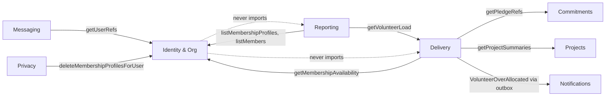

# Employee (volunteer) onboarding — design (US-1.5)

*2026-09-04. New tables in `identity`; a new derived read in `delivery`; a new
composed read in `reporting`.*

Acceptance criteria are already agreed in `PRODUCT_BACKLOG.md` § *US-1.5 Employee
(volunteer) onboarding*, and they were refined today. This document designs **to**
them; it does not restate or renegotiate them. Two places where the wording and
the stated rationale pull in different directions are called out explicitly
(§4.1, §7.3) — in both cases the design follows the rationale, and both are
listed as open decisions rather than settled unilaterally.

---

## 0. Verdict on the shape

The slice is **three small pieces of structure, not one feature**:

1. **A person-level display name** — one nullable column on `users`, and a single
   label rule inside Identity that every naming surface already routes through.
2. **A membership-level profile** — `membership_profiles` (+ a skills join table),
   keyed on the membership row so "this is one employer's week" is a database
   fact rather than a convention.
3. **A derived over-allocation figure** — computed in **Delivery**, because
   Delivery owns the allocations and already imports Identity in the correct
   direction. Nothing is stored.

Four amendments to the obvious reading of the story, each argued below:

- **The over-allocation sum is scoped to one organisation's live workspaces**, not
  to "every live workspace" globally (§4.1). The AC's own multi-tenancy rationale
  requires it; the literal wording does not say so.
- **`allocations` gets its missing unique constraint in this slice** (§2.5). The
  whole feature is a sum over a table that can currently hold the same person
  twice.
- **The roster read lives in Reporting**, the read-only composer, not in Delivery
  and not in the route (§1.4).
- **The over-allocation notification fires on a *transition* into (or a worsening
  of) over-allocation**, not on every allocate call (§4.5). Otherwise nudging a
  number from 6 to 7 to 8 pings the volunteer three times, and the `hours` kind
  they then silence also carries their hour approvals.

---

## 1. Where each piece lives

### 1.1 The module map after this slice



Every new edge runs downstream→upstream. No cycle is created, and none of the
existing edges changes direction.

### 1.2 The central question: who computes over-allocation

> `SUM(allocations.hours_per_week) across live workspaces > profile.weekly_hours`.
> Availability is Identity's; allocations are Delivery's.

Four candidate homes, judged against the two precedents named in the brief:

| Option | Verdict |
|---|---|
| **Identity** computes it | **No.** Identity would have to read `allocations`, `delivery_workspaces` and `pledges` — either directly (three boundary violations) or by importing Delivery, which is the **cycle** US-10.7 exists to warn about. Identity is the root of the dependency graph; nothing it does may depend on anything downstream. |
| The **route** computes it (the US-10.7 shape) | **No.** US-10.7's lesson is *"do not create a cycle"*, not *"gates go in routes"* — the US-8.3 design says this in as many words, and it applies identically here. The seat gate had to leave the domain because the dependency ran the wrong way. Here it runs the right way. A route-level computation would also need to exist in **two** callers (the allocation API route and the server-rendered roster page, which calls the domain directly — see `src/app/workspaces/[id]/page.tsx`), which is two copies of one definition and the drift the reporting boundary test exists to prevent. |
| **Reporting** computes it | **No, not as the home.** The figure is needed on a **write** path — `allocateVolunteer` must flag it at the point of decision and emit the notification. Delivery would then import Reporting, and Reporting imports Delivery: a cycle, arrived at from the other end. |
| **Delivery** computes it | **Yes.** Delivery owns `allocations`, already imports Identity (`findMembership`, `listMembers`), already imports Commitments (`getPledgeRef`) and Projects (`getProjectRef`). Every input is either its own table or a barrel read it already makes. The sum has exactly one definition, on the write path and the read path, in the module that owns the numerator. |

**Decision: Delivery computes it.** Identity exposes availability as a *reference
read* in the established `getUserRefs`/`getOrganisationRefs` shape; Delivery does
the arithmetic.

The important structural consequence is that Identity never learns that
allocations exist. A future "how much of my week is committed?" surface on the
volunteer's own profile page is composed the same way the roster is (§1.4) — it
does **not** become a field Identity can compute.

### 1.3 Which module owns the *availability* read

Identity, as `getMembershipAvailability(organisationId, userIds, exec)`. Two
things about that signature are deliberate:

- **It takes an `organisationId` and is scoped by it.** There is no
  `getAvailability(userId)`. The profile belongs to the membership, so a caller
  must name the employer whose week it is asking about — which makes the AC's
  "no organisation can learn that I hold a membership anywhere else" true by the
  shape of the function rather than by a filter someone can forget.
- **It carries no authorisation**, exactly like `getUserRefs` and `getPledgeRef`,
  and its doc comment must say so in those words. Callers establish standing
  first. The two callers do: `allocateVolunteer` has already asserted the acting
  user is a `csr_manager` of that corporation before it reaches the sum, and
  `getVolunteerLoad` asserts membership itself (§4.2).

### 1.4 The roster read lives in Reporting

The roster is *members* (Identity) + *profiles* (Identity) + *load* (Delivery).
Three public reads, two modules, no tables of its own. That is Reporting's
literal charter, and `src/modules/reporting/boundary.test.ts` already
mechanically forbids the new file from touching a table — the guard comes free by
adding one path to its `FILES` array.

Rejected alternatives:

| Option | Why rejected |
|---|---|
| **Delivery** hosts the roster | Delivery's barrel would then export a function about *skills and seniority* — data it does not own and has no delivery-time use for. That is how a module becomes the place things go when nobody wants a new file. |
| **Identity** hosts the roster | Needs the load. Cycle. |
| The **route/page** composes it | Two consumers (`GET /api/organisations/[id]/roster` and the roster page), so two copies of the zip logic, and no unit under test that is not an HTTP call. |
| A **new module** | It owns nothing and would exist to hold one function. Reporting already is that module. |

**Reporting adds no authorisation of its own, and that is load-bearing.** All
three of its calls authorise independently: `listMembers` throws `NotFoundError`
for a non-member; `listMembershipProfiles` additionally requires
`csr_manager | charity_owner`; `getVolunteerLoad` re-checks the same. A composer
that authorised *instead of* its sources would be an authorisation bypass waiting
for a second caller.

One thing Reporting must **not** do here: `getVolunteerRoster` goes in a new
`roster.ts`, **not** in `service.ts`, and it does **not** call
`assertEntitlement`. Allocation is core loop. Gating a corporation's ability to
see its own people behind a plan would breach `MONETISATION_MODEL.md` Principle 3
/ US-10.4, and putting the function next to the entitlement-gated CSR dashboard
is how someone later "tidies up" by adding the gate. Asserted by a test (§10, t31).

---

## 2. Data model

Migration `drizzle/0018_*.sql` — generated by drizzle-kit from `src/db/schema.ts`,
not hand-numbered (0017 is the US-8.2 preferences migration).

### 2.1 One table or two? And where does the display name go?

Two axes, so two homes. Display name is person-level; skills, seniority, hours and
the note are membership-level. A single table cannot express both without either
duplicating the name per membership (so "one human, one name" becomes a
consistency problem nobody will maintain) or scoping availability to the person
(which the AC forbids outright and for good reason — donated hours are one
employer's hours to donate).

**The display name is a nullable column on `users`, not its own table.** This is
the decision I expect to be argued with, so the reasoning in full:

*For a separate `user_profiles` table:* `users` is close to a credentials row;
presentation data does not obviously belong there; a table leaves room for
pronouns/locale/timezone later.

*For a column, which is what I recommend:*

1. **`getUserRefs` is the hot path and already selects from `users`.** Every
   naming surface in the AC — `authorLabel`, the board's `labelAllocations`, the
   roster — resolves a batch of user ids to a label. A column makes that a
   two-word diff. A table makes it a join or a second batched query in the one
   function that must never N+1.
2. **Erasure gets *stronger*, not weaker.** With a column, "delete the display
   name" is `displayName: null` inside the **same `UPDATE users`** that already
   anonymises the email in `eraseUser`. There is no separate sweep line to forget.
   With a table it is one more `DELETE` in a hand-written list — the exact failure
   mode the Privacy comment warns about.
3. `users` already carries `consentedAt`, `deletedAt` and `isPlatformAdmin`. It is
   the *person* row, not a credentials row, and Identity owns all of it.
4. YAGNI is symmetric here. The out-of-scope list rules out avatars, photos, CVs
   and certifications. There is one person-level field and no second on the
   roadmap. If a second arrives, adding a table and backfilling one column is a
   ten-minute migration.

### 2.2 The tables

```
users
  display_name             text                      -- NEW. null = never set; falls back to email.

membership_profiles
  membership_id            uuid        pk  references memberships(id) ON DELETE CASCADE
  weekly_hours             integer     not null
  seniority                text                      -- a SENIORITY_LEVELS code, or null
  note                     text                      -- <= 500 chars; DISPLAYED, never matched
  created_at               timestamptz not null default now()
  updated_at               timestamptz not null default now()
  check (weekly_hours >= 0 and weekly_hours <= 168)   -- 0 is a real answer; absent row is not

membership_profile_skills
  membership_id            uuid        not null references membership_profiles(membership_id) ON DELETE CASCADE
  skill_code               text        not null      -- a VOLUNTEER_SKILLS code; text, not an enum
  primary key (membership_id, skill_code)
  index (skill_code)                                  -- the US-4.3 reverse lookup, named now

allocations
  + unique (delivery_workspace_id, volunteer_user_id) -- NEW; see §2.5
```

No new enums. Drizzle names: `membershipProfiles`, `membershipProfileSkills`.

**The primary key is `membership_id`, not `(user_id, organisation_id)`.** This is
the US-6.3 move: `delivery_tasks.assigned_allocation_id` points at an
`allocations` row rather than a user id, which makes "the assignee is allocated to
this workspace" true by construction. Same here — "this profile belongs to this
membership" stops being a rule and becomes a key. It also gives the US-10.7 AC
bullet ("the seat is released, that organisation's copy of my profile goes with
it") for free, in the database, instead of as a line in `removeMember` that
somebody can delete during a refactor (§6.2).

**Skills are a join table, not `text[]` and not `jsonb`.**

| Option | Assessment |
|---|---|
| `jsonb` | Rejected outright. It buys the freedom of an unvalidated shape, which is exactly what a controlled registry exists to remove, and it is the worst of the three to index and to join. |
| `text[]` | Genuinely cheaper *for this slice*, which stores and shows and matches nothing. One row per profile, one column update on save, no child table. Rejected because this slice exists mainly to give US-4.3 a credible employee side, and the migration from `text[]` to rows later is a backfill against live data. |
| **join table** | **Chosen.** Per-skill rows are what US-4.3's `WHERE skill_code = ANY($needs)` wants, indexed and plan-stable, and they are somewhere to hang a future `level` / `years` / `is_primary` column without reshaping an array. Cost: one extra table and a delete-then-insert inside the save transaction. Small, paid once. |

What each costs US-4.3, concretely: with rows, matching a project's converted
`resource_needs.skill` set is an indexed equality join over `skill_code`. With
`text[]` it is a GIN index and an `&&` overlap, which works, but any per-skill
attribute (confidence, recency, primary) then requires a second parallel array
kept in lockstep by application code. That is the shape that rots.

**`skill_code` is `text`, not a pgEnum**, for the same reason
`notification_preferences.kind` is text: the code registry is the single
authority, and adding a skill must not need a migration. Reads iterate the
registry, so a row holding a retired code is simply invisible. **Codes are
append-only** — the US-8.2 lesson applies verbatim: renaming a code in place
silently orphans every stored row. Retire a skill by removing it from the
registry *and migrating its rows*, never by renaming.

### 2.3 Why `weekly_hours` is an integer, and not nullable

- **Integer, not `numeric`.** `allocations.hours_per_week` and `hour_logs.hours`
  are both integers, so the whole donated-time system is integer-hours. A
  fractional availability would make the over-allocation comparison mix units.
  Known limit, stated rather than hidden: someone offering thirty minutes a week
  must round. Nobody has asked for that; if they do, the change is one column
  type in three tables, together.
- **`not null` on the column, with the *absent row* carrying "unknown".** This is
  the AC's discipline made structural: the schema offers no way to write a row
  that says nothing. `weekly_hours = 0` means *offered none*; **no row at all**
  means *no stated availability*. Reads must surface `weeklyHours: number | null`
  where `null` comes only from a missing row (§7.4), and nothing may coalesce it
  to 0 — the same rule as pending-vs-approved hours.
- **Range 0–168.** No business cap. 40 would be wrong (a full-time secondment is
  37.5 and a sum across workspaces can legitimately exceed 40); anything else is
  invented. The physical week is the only bound that cannot be argued with. The
  form should soft-warn above 40 in copy; the constraint should not lie.

### 2.4 Display-name validation, and the risk it introduces

```ts
const displayName = z
  .string()
  .trim()
  .min(1)
  .max(80)
  .refine((s) => !/\p{C}/u.test(s), 'A display name cannot contain control characters.');
```

`\p{C}` covers control *and* format characters, so zero-width joiners and
bidi-override tricks are rejected along with `\n`. That also blocks ZWJ emoji
sequences; acceptable, arguably desirable, and worth saying out loud rather than
discovering as a bug report.

**A risk this slice creates and must not hand-wave:** the display name is
user-generated content rendered *to another organisation* (`authorLabel` reaches
the counterparty charity). US-9.1/9.2 moderation does not reach it, and a
platform admin has no view of message threads (US-8.3 decision 5) where it is
most visible. Two structural mitigations, plus one accepted residual:

- **Attribution is never the name alone.** `MessageView` already carries
  `authorOrgName`, and the roster carries `email` and `role`. A reader always sees
  "Dana Okafor · Globex Ltd", so impersonating a *person* is weak and
  impersonating *HodorHub* is contradicted on the same line.
- **The admin still sees the email** in the member list — the AC guarantees this —
  so the organisation that invited someone can always identify and remove them.
- **Residual:** a slur as a display name is visible to a counterparty until that
  person's own employer removes them. Logged as open decision 4. I do **not**
  recommend building moderation for it in this slice.

**No uniqueness constraint on the display name.** Two Dana Okafors in one
organisation is real and fine. Uniqueness would be a false promise of identity.

### 2.5 The defect: `allocations` has no unique `(workspace, volunteer)`

The PO is right, and **this slice fixes it.** The reasoning, and then the risk.

*Why it cannot be tolerated here.* The entire feature is a **sum over
`allocations`**. Shipping a warning derived from a sum we know can double-count
means the first false "you are over-allocated" notification lands on a volunteer
who is not — and a merit-and-trust product cannot afford a number that is
sometimes wrong for a reason we already knew about. Tolerating it would force a
defensive `MAX(hours_per_week) per (workspace, volunteer)` in the new sum, which
is a **second definition of "allocated hours"** that disagrees with
`effortFor`'s existing straight `SUM` on the same rows — two numbers on one board.

*Why it is this story's job.* Nobody else will do it, and it gets harder with
every real row. The existing code already half-anticipates the plurality
(`loadParticipant` returns `allocationIds: string[]`) and half-breaks on it
(`labelAllocations` would render the same person twice, `effortFor` already
double-counts today).

*Product meaning, so the constraint is not merely defensive:* one person, one
workspace, one weekly commitment. A second row is not a second commitment; it is
a mistake or a re-allocation. So `allocateVolunteer` becomes an **upsert**:

```
insert into allocations (delivery_workspace_id, volunteer_user_id, hours_per_week)
values (...)
on conflict (delivery_workspace_id, volunteer_user_id)
do update set hours_per_week = excluded.hours_per_week
returning id
```

`onConflictDoUpdate`, never `onConflictDoNothing` — `DO NOTHING` returns zero rows
on conflict, which is the bug the US-8.3 thread upsert calls out by name.
Re-allocating Dana from 4 h/w to 6 h/w means Dana is on **6**, not 10, which is
the only reading a CSR manager would expect, and it makes a double-clicked button
idempotent.

**Migration and backfill risk, stated precisely.** The migration must run in this
order or it will either fail loudly or destroy approved hours:

1. Identify duplicate `(delivery_workspace_id, volunteer_user_id)` groups. Elect
   the survivor as the row with the **largest** `hours_per_week`, tie-broken by
   `id` — largest, so the collapse can never silently *reduce* a committed
   capacity a charity is counting on.
2. **Repoint `hour_logs.allocation_id`** from the losers to the survivor. Approved
   hours survive erasure (US-6.2a); they must certainly survive a schema change.
3. **Repoint `delivery_tasks.assigned_allocation_id`** likewise, or a board loses
   its assignments.
4. Delete the losing `allocations` rows.
5. `CREATE UNIQUE INDEX allocations_workspace_volunteer_uq ON allocations
   (delivery_workspace_id, volunteer_user_id);`

Steps 2 and 3 are not optional politeness: both FKs are `ON DELETE no action`, so
skipping them makes step 4 fail with 23503 — loud, not silent, which is the good
outcome, but it means a migration that gets this wrong blocks a deploy.

**Operational note (not MVP-blocking):** `CREATE UNIQUE INDEX CONCURRENTLY`
cannot run inside a transaction, and drizzle wraps migrations in one. At MVP
table sizes a plain `CREATE UNIQUE INDEX` takes a lock for milliseconds. Note it
in the migration file so nobody copies the pattern onto a large table later.

**What the sum does meanwhile:** nothing "meanwhile" — the constraint lands in
the same migration as the profile tables, so the derived figure is never live
against un-deduplicated data. And the sum is written as a **plain `SUM`, matching
`effortFor` exactly** — deliberately *not* defensively de-duplicated. If the
constraint were ever dropped, the figure would over-count, which surfaces the
corruption. A silent `MAX()` would hide it.

---

## 3. The skills registry, and seniority

### 3.1 Which module owns it

**Identity**, at `src/modules/identity/skills.ts`, exported from the barrel.

The US-11.12 principle is *ownership follows the thing the registry governs*:
"AgentDelivery owns it because it owns what the agents can actually build." Here
the registry validates a column Identity owns, and today Identity is its only
writer.

The obvious objection is US-4.3: converting `resource_needs.skill` will need the
same registry, and that column is **Projects'**. Two answers. First, Projects
already imports Identity (the publish gate calls `assertOrganisationVerified`), so
that edge exists and runs the right way. Second, and more important, **Identity
is the root of the dependency graph** — it is the one module every other module
may import without any risk of a cycle. That makes it the correct home for a
vocabulary two contexts will share, and it avoids inventing a `taxonomy` module
that owns no tables and would immediately become a dumping ground. `src/lib/` was
also considered and rejected: `lib` is infrastructure (http, mailer, password,
model-provider), not domain vocabulary.

### 3.2 Shape — the US-11.12 pattern, verbatim

```ts
import { projectCategory } from '@/db/schema';

type ProjectCategory = (typeof projectCategory.enumValues)[number];

export const VOLUNTEER_SKILLS = [
  { code: 'backend-development', label: 'Backend development', categories: ['software'] },
  // ...
] as const;

export type VolunteerSkill = (typeof VOLUNTEER_SKILLS)[number];
export type VolunteerSkillCode = VolunteerSkill['code'];

/** Codes as a non-empty tuple so `z.enum` derives from the registry, never restates it. */
export const VOLUNTEER_SKILL_CODES = VOLUNTEER_SKILLS.map((s) => s.code) as unknown as [
  VolunteerSkillCode,
  ...VolunteerSkillCode[],
];

export function getSkill(code: string): VolunteerSkill | undefined;
/** Drives the profile form grouped by category, and later the US-4.1 filter. */
export function skillsForCategory(category: string | null | undefined): readonly VolunteerSkill[];
/** The US-4.3 seam: a volunteer's chosen skills projected onto the category axis. */
export function categoriesForSkills(codes: string[]): ProjectCategory[];
```

Three properties carried over from `templates.ts` on purpose:

- `as const`, so the codes are a literal union and zod derives from the array
  rather than restating it. Schema and registry cannot drift.
- **Code, not an admin toggle.** The AC says "one controlled registry held in
  code". Widening the taxonomy is a reviewed pull request. Admins may read it
  (`GET /api/skills`, §7.1) but never write it.
- The type is derived from the data, so a mistyped category in a row is a compile
  error against `ProjectCategory`, not a runtime surprise.

Deliberately **not** carried over: `templates.ts` has an `assertTemplateEligible`
throw-guard because eligibility is a relation between a template and a *specific
project*. A skill is not eligible or ineligible — it exists or it does not. So
validation is zod at the domain edge, which gives the AC's required field-level
error via the route's existing `ZodError → 400 { error: 'validation', details:
flatten() }` path. No custom error class, no new `DOMAIN_STATUS` entry.

### 3.3 The principle used to choose the skills

> A skill earns a row if a **charity could plausibly ask for it by name** in a
> resource need (US-2.2) *and* a **corporation could plausibly have someone who
> does it as a job**. That intersection is where US-4.3's match has to land.

Four rules follow from it:

1. **Role or craft granularity, never tools.** "Backend development", not
   "Node.js"; "Data analysis", not "Pandas". Tools turn over every eighteen
   months, which makes the registry a treadmill and the match a false-precision
   filter. The free-text `note` beside the chosen skills carries "mostly Django"
   for a human to read — displayed, never matched, exactly as the AC says.
2. **Every skill maps to at least one `project_category`.** A skill mapping to
   none is a form field nobody can be matched against.
3. **Every category has at least three skills as its primary home**, so no
   category is a dead end on the employee side.
4. **When in doubt, leave it out.** A too-short list is a request; a too-long list
   is a scroll nobody reads to the bottom of, and a long tail of near-duplicates
   ("Brand strategy" vs "Graphic design & branding") splits the same people across
   two codes and makes the eventual match *worse*.

### 3.4 The list — 39 entries, first draft for review

Grouped by primary category. The `categories` column is the full mapping; a skill
appearing under one heading may still be tagged with others.

**Software (7)**

| code | label | categories |
|---|---|---|
| `backend-development` | Backend development | software |
| `frontend-development` | Frontend development | software, design |
| `mobile-development` | Mobile app development | software |
| `qa-testing` | Software testing & QA | software |
| `devops-cloud` | DevOps & cloud infrastructure | software, operations |
| `data-engineering` | Data engineering | software, research |
| `security-engineering` | Security engineering | software, operations |

**Design (5)**

| code | label | categories |
|---|---|---|
| `ui-design` | UI & interaction design | design, software |
| `ux-research` | UX & user research | design, research |
| `graphic-design` | Graphic design & branding | design, marketing |
| `copywriting` | Copywriting & editing | design, marketing, fundraising |
| `accessibility` | Accessibility (a11y) | design, software |

**Construction (6)**

| code | label | categories |
|---|---|---|
| `carpentry` | Carpentry & joinery | construction |
| `electrical` | Electrical work | construction |
| `plumbing` | Plumbing & heating | construction |
| `general-building` | General building & renovation | construction |
| `architecture-surveying` | Architecture & surveying | construction, design |
| `health-and-safety` | Health & safety | construction, events, operations |

**Marketing (4)**

| code | label | categories |
|---|---|---|
| `digital-marketing` | Digital marketing & SEO | marketing |
| `social-media` | Social media management | marketing, fundraising |
| `video-photography` | Video & photography | marketing, design, events |
| `public-relations` | PR & communications | marketing, events |

**Fundraising (3)**

| code | label | categories |
|---|---|---|
| `grant-writing` | Grant writing & bid support | fundraising, research |
| `corporate-partnerships` | Partnerships & major donors | fundraising, marketing |
| `fundraising-campaigns` | Fundraising campaign design | fundraising, marketing |

**Events (3)**

| code | label | categories |
|---|---|---|
| `event-production` | Event production & logistics | events, operations |
| `volunteer-coordination` | Volunteer coordination | events, operations |
| `facilitation-training` | Facilitation & training | events, operations, research |

**Research / Data (3)**

| code | label | categories |
|---|---|---|
| `data-analysis` | Data analysis | research, software |
| `impact-evaluation` | Impact measurement & evaluation | research, fundraising |
| `data-science` | Data science & machine learning | research, software |

**Legal (4)**

| code | label | categories |
|---|---|---|
| `contract-law` | Contracts & commercial law | legal |
| `charity-governance` | Charity governance & compliance | legal, operations |
| `employment-law` | Employment & HR law | legal, operations |
| `data-protection-law` | Data protection & privacy law | legal, operations, software |

**Operations (4)**

| code | label | categories |
|---|---|---|
| `project-management` | Project & delivery management | operations, software, construction, events |
| `finance-accounting` | Finance & accounting | operations, fundraising |
| `hr-people` | HR & people operations | operations |
| `it-support` | IT support & systems administration | operations, software |

**Considered and cut, with reasons** — so the review argues about the right
things:

- `software-architecture` — architecture at this scale is a *seniority* signal,
  and there is a seniority field. Cutting it avoids two fields describing one
  thing.
- `business-analysis` — a real corporate role, but charities do not ask for it by
  name; `project-management` and `facilitation-training` cover what they do ask
  for. Weakest against rule 1; the most likely of these to be argued back in.
- `brand-strategy` — splits the same people off `graphic-design` and
  `digital-marketing`.
- `av-technical` — folded into `event-production`.
- `ip-law` — rare enough that `contract-law` covers the realistic asks.
- `procurement` — rare; folded conceptually into `finance-accounting`.
- `social-research` — duplicates `ux-research`, which is relabelled "UX & user
  research" to absorb it.

### 3.5 Seniority: a small controlled vocabulary, not free text

The AC leaves it optional and unspecified. **Recommendation: a controlled list of
six, in the same `skills.ts` file.**

```ts
export const SENIORITY_LEVELS = [
  { code: 'learning',     label: 'Learning / early career' },
  { code: 'practitioner', label: 'Practitioner' },
  { code: 'experienced',  label: 'Experienced' },
  { code: 'lead',         label: 'Lead / principal' },
  { code: 'executive',    label: 'Executive / director' },
  { code: 'specialist',   label: 'Independent specialist' },
] as const;
```

*Why not free text.* Free text is the honest answer to "every company's ladder is
different", and I took it seriously. It loses on three counts: it is
unaggregatable and unfilterable, so it can never help the CSR manager scan a
roster (its only purpose — the charity never sees it); it invites exactly the junk
the AC worries about ("Rockstar Ninja", or a job title that is really a
department); and it is a *second* free-text field about a person, on top of the
note, that erasure must sweep and nobody can moderate.

*Why these six.* They are deliberately **not a ladder transplanted from a tech
company**. `specialist` is the contractor/consultant the AC names; `executive` is
the exec; and the field is nullable, which is the "non-technical, doesn't apply"
answer. No numbers, no "Junior" — the volunteer reads these labels on their own
profile, and the CSR manager reads them on the roster, so they must be plain and
non-pejorative in both places.

**The registry carries no ordinal field, on purpose.** The moment a `rank: number`
exists, something sorts by it, and the AC says seniority ranks nobody. There is no
comparison operator on this value anywhere in the codebase, and a test asserts
that (§10, t14).

Stored as `text` for the same reason as `skill_code`: the registry is the
authority and adding a level must not need a migration.

---

## 4. The over-allocation read

### 4.1 "Live workspaces" — and the one place the AC's wording and rationale differ

The AC says: *"my total across every workspace on a project that is not
*completed* or *archived*"*. Taken literally, that sums a volunteer's allocations
across **all** their employers.

That cannot be what is meant, and the AC itself says why two bullets earlier:
*"Donated hours are the employer's hours to donate, so '4 hours a week' is only
ever a statement about one employer's week"* and *"no organisation can learn that
I hold a membership anywhere else"*. A global sum would (a) compare Acme's stated
N against a total inflated by Globex's allocations, producing a warning about a
constraint Acme cannot see or fix, and (b) leak the existence of the second
employer through the arithmetic — the CSR manager would see a total larger than
anything they allocated.

**Design decision: the sum is scoped to the allocating organisation's
workspaces.** Same-employer only. Logged as open decision 1 for the PO to confirm
the wording; the behaviour is not in real doubt.

"Live" resolves as: workspace → `pledge.corporationOrgId == organisationId`, and
workspace → `project.status ∉ {completed, archived}`. Both facts come through
barrels Delivery already imports. Note that `draft` and `published` are
unreachable for a workspace (a workspace only exists for an accepted pledge), so
the AC's two-status exclusion is complete as written.

### 4.2 Signatures

New file `src/modules/delivery/availability.ts`, sibling to `service.ts` and
`workspace.ts`, exported from the Delivery barrel.

```ts
export interface VolunteerLoad {
  volunteerUserId: string;
  /** Committed hours/week across THIS organisation's live workspaces. */
  allocatedHoursPerWeek: number;
  /** The membership profile's figure. null = NO STATED AVAILABILITY (never 0). */
  statedWeeklyHours: number | null;
  /** null when statedWeeklyHours is null — unknown is never "over". */
  overAllocated: boolean | null;
  /** allocatedHoursPerWeek - statedWeeklyHours when over; otherwise null. */
  overBy: number | null;
  /** Where the load is, so a manager can act on it. Live workspaces only. */
  liveWorkspaceIds: string[];
}

/**
 * US-1.5 — derived at read time, never stored, never shown to the charity.
 * Requires csr_manager or charity_owner of `organisationId`; 404 for a
 * non-member (no existence leak), 403 for the wrong role.
 */
export async function getVolunteerLoad(
  actingUserId: string,
  organisationId: string,
  volunteerUserIds: string[],
  db?: Db,
): Promise<VolunteerLoad[]>;

/** Unauthenticated internal — callers have already established standing. */
async function loadFor(
  exec: Executor,
  organisationId: string,
  volunteerUserIds: string[],
): Promise<VolunteerLoad[]>;
```

And on the Identity barrel:

```ts
/**
 * US-1.5 — stated weekly availability for members of ONE organisation.
 * Organisation-scoped by signature, so one employer's read can never surface
 * another employer's profile. Carries no authorisation, in the shape of
 * getUserRefs/getPledgeRef: the caller establishes standing first.
 * A user with no profile row is simply absent from the result — the caller must
 * render that as "no stated availability", never as 0.
 */
export async function getMembershipAvailability(
  organisationId: string,
  userIds: string[],
  exec?: Executor,
): Promise<{ userId: string; membershipId: string; weeklyHours: number }[]>;
```

And on the Commitments barrel — a batched sibling of `getPledgeRef`, with the
existing single read **reimplemented over it** so there is one definition in two
shapes (the US-8.3 `hasCorporateRelationship` rule):

```ts
export async function getPledgeRefs(
  pledgeIds: string[],
  exec?: Executor,
): Promise<{ id: string; projectId: string; corporationOrgId: string; status: PledgeStatus }[]>;
```

### 4.3 The query

`loadFor` in five steps, all through barrels or its own table:

1. `allocations` where `volunteer_user_id IN (ids)` → `{ id, deliveryWorkspaceId,
   volunteerUserId, hoursPerWeek }`.
2. `delivery_workspaces` where `id IN (workspaceIds)` → `{ id, projectId,
   pledgeId }`. *(Delivery's own table.)*
3. `getPledgeRefs(pledgeIds, exec)` → keep only workspaces whose pledge's
   `corporationOrgId === organisationId`. **This is the tenancy filter.**
4. `getProjectSummaries(projectIds, exec)` → keep only projects whose `status` is
   neither `completed` nor `archived`. **This is the liveness filter.**
5. `getMembershipAvailability(organisationId, ids, exec)`; sum surviving
   `hoursPerWeek` per volunteer; `overAllocated = stated !== null && sum > stated`.

Five small round trips, single-digit row counts, all indexed. Deliberately not one
hand-rolled SQL join across four contexts' tables — that is the query nobody
updates when a fifth signal lands, and it would be four boundary violations.

`getProjectSummaries` and `getPledgeRefs` both accept an `Executor`, so the whole
thing runs inside `allocateVolunteer`'s transaction unchanged.

### 4.4 The write path: flag at the point of decision

`allocateVolunteer` computes the load **before** the upsert and **after** it,
inside the same transaction, and returns the "after":

```ts
export async function allocateVolunteer(
  actingUserId: string,
  workspaceId: string,
  volunteerUserId: string,
  hoursPerWeek: number,
  db?: Db,
): Promise<{ allocationId: string; load: VolunteerLoad }>;   // load is NEW, additive
```

Computing after the write, rather than simulating the addition, means there is
**one** code path and no "what if we applied it" arithmetic that can disagree with
the read path. And it makes "over-allocation warns, it never refuses" structural:
by the time we know, the row is already committed to the transaction and there is
nothing to refuse.

The 201 body carries the load, which is the "flagged to the CSR Manager at the
point of decision" surface (§8 is honest about there being no allocation *form* to
render it in yet).

### 4.5 The notification

Emitted to the outbox inside the same transaction — never inline, for the usual
two reasons (the dual write the outbox exists to eliminate, and Delivery would
otherwise import Notifications).

```
eventType: 'VolunteerOverAllocated'
payload: {
  volunteerUserId:        string,
  organisationId:         string,
  workspaceId:            string,
  projectId:              string,
  allocationId:           string,
  allocatedHoursPerWeek:  number,   // the total, after this allocation
  statedWeeklyHours:      number,   // never null — we only emit when it is known
}
```

**Emission condition** — this is a design choice, not an oversight:

```
after.overAllocated && (!before.overAllocated || after.allocatedHoursPerWeek > before.allocatedHoursPerWeek)
```

A transition into over-allocation, or a worsening of one. With the upsert in
place, nudging 6 → 7 → 8 would otherwise send three notifications about one fact,
and the volunteer's rational response is to silence the `hours` kind — which also
silences their **hour approvals**. Notification fatigue is what US-8.2 exists to
fight; re-emitting an unchanged fact is how you lose to it.

**Deliberate non-triggers**, stated so they are not read as bugs: lowering your
own stated hours, or another project ceasing to be `completed`, can both create an
over-allocation with no event. The AC's trigger is *"when my CSR Manager allocates
me"*, and you do not need telling about your own edit. Because the figure is
derived at read time, the roster reflects those changes immediately anyway — which
is the payoff for never storing it.

**No `charityOrgId` on the payload, and no project title.** No charity-side
consumer exists and the AC says the charity never sees this; the event carries
nothing addressable to a charity, so a future careless `case` cannot route it
there. The title is omitted because a volunteer over-allocated across three
projects would be told about one of them, which is misleading.

**Notifications wiring:**

```ts
case 'VolunteerOverAllocated': {
  // Only the volunteer. The CSR manager already knows — they just did it, and
  // the allocation response told them.
  await create(ctx, p.volunteerUserId as string, 'hours.over_allocated', p);
  break;
}
```

`copy.ts` gains one entry; `preferences.ts` adds the type to the **existing
`hours` kind** (the AC's *donated hours* kind) and updates its description. The
kind's `code: 'hours'` is **not** touched — it is stored free text in every user's
saved row and renaming it would silently un-silence everyone (the append-only rule
in `preferences.ts`). Implementation order matters: add the copy key first, since
`NotificationKind.types` is typed `NotificationType[]` against the copy map.

```ts
'hours.over_allocated': {
  title: 'You are allocated more hours than you offered',
  body: (p) =>
    `You are now allocated ${hoursOf(p, 'allocatedHoursPerWeek')} hours a week across live projects, against the ${hoursOf(p, 'statedWeeklyHours')} you offered. Your CSR manager made this call — talk to them if it does not work.`,
},
```

**One honest trade-off on the payload.** The two integers sit in `outbox.payload`
(retained after publish) and `notifications.payload`. `eraseUser` deletes the
user's notifications, so that copy goes; the outbox row's does not. The
alternative — ids only, figures re-read at render — would make Notifications read
Delivery's and Identity's tables, which is strictly worse. And the underlying
allocation rows survive erasure by design (the AC says so). Two integers is an
accepted trace; logged as open decision 5, non-blocking.

---

## 5. Naming: `authorLabel`, `labelAllocations`, and *Former member*

### 5.1 One label rule, inside Identity, applied by the reads

Neither Messaging nor Delivery may reach past a barrel, and neither should carry
its own copy of "how a person is named". So the rule lives in Identity, as a
private helper that **every read applies**, rather than an exported formatter a
caller can forget to call:

```ts
function personLabel(u: {
  email: string;
  displayName: string | null;
  deletedAt: Date | null;
}): string {
  if (u.deletedAt) return 'Former member';   // FIRST, deliberately — see below
  return u.displayName ?? u.email;
}
```

`getUserRefs` gains the columns and the derived field:

```ts
export async function getUserRefs(
  ids: string[],
  exec?: Executor,
): Promise<{ id: string; email: string; displayName: string | null; label: string; erased: boolean }[]>;
```

Messaging's change is the one line US-8.3 promised:

```ts
const authors = new Map((await getUserRefs(authorIds, db)).map((u) => [u.id, u.label]));
// authorLabel: authors.get(m.authorUserId) ?? 'Former member'   ← unchanged
```

The trailing `?? 'Former member'` stays for the impossible missing-row case. No
other change anywhere in Messaging.

### 5.2 Why the `deletedAt` check comes first

`eraseUser` nulls `display_name` in the same statement that rewrites the email, so
by the time a row is erased both the name and the real email are gone. Checking
`deletedAt` first is therefore redundant — **and that is the point**. It is
defence in depth: if the null-ing were ever dropped from `eraseUser` in a
refactor, the label is still *Former member*. Two independent mechanisms produce
the AC's outcome, and §10 has a test for each so a regression in one is visible.

Without this, the current behaviour is the bug the AC names: an erased author
renders as `erased-<uuid>@erased.invalid`, because `getUserRefs` returns the
`users` row and Messaging's `?? 'Former member'` only fires when the row is
*missing*, which it never is.

### 5.3 `labelAllocations` — the board

`listMembers` is extended rather than replaced, because it is the read that
carries the authorisation Delivery is relying on (`getUserRefs` carries none):

```ts
export async function listMembers(
  actingUserId: string,
  organisationId: string,
  db?: Db,
): Promise<{
  userId: string;
  role: MemberRole;
  email: string | null;
  displayName: string | null;
  label: string;          // same personLabel rule — one definition, two shapes
}[]>;
```

While in there, fix its N+1: it currently does `Promise.all` of one `findFirst`
per member; one `inArray` does the job. Small, and it is the query the roster
now leans on.

`labelAllocations` changes by one word — the map holds `label` instead of `email`:

```ts
const labels = new Map<string, string>();
if (p.side === 'corporation') {
  for (const m of await listMembers(actingUserId, p.corporationOrgId, exec as Db))
    labels.set(m.userId, m.label);
}
// ...
label: labels.get(a.volunteerUserId) ?? `Volunteer ${i + 1}`,
```

**The charity branch is untouched, and that is the AC bullet.** The map is only
populated when `p.side === 'corporation'`, so the charity still gets
`Volunteer 1..n` — no display name, no email, no skills, no availability, no
over-allocation. §10 t20 proves it *with* display names set, which is the only
version of that test that is not vacuous.

---

## 6. Erasure and lifecycle

### 6.1 What Privacy must do

`eraseUser` gains **two visible lines**, both named in the sweep the way the
existing comment demands:

```ts
// US-1.5 — a skills profile is one-sided; unlike a US-8.3 message, nobody
// else's record depends on it. DELETED, not redacted, for every organisation
// this user belongs to.
await deleteMembershipProfilesForUser(userId, tx);
```

and, inside the existing `UPDATE users`:

```ts
.set({
  email: `erased-${userId}@erased.invalid`,
  displayName: null,          // ← NEW, in the SAME statement
  passwordHash: 'erased',
  // ...
})
```

Identity exposes the primitive; Privacy calls it. This is exactly the convention
`redactMessagesByAuthor` established yesterday — the query stays inside the module
that owns the table, and Privacy's list of tables stays explicit and readable:

```ts
/** Called by Privacy inside its erasure transaction (US-1.5). */
export async function deleteMembershipProfilesForUser(
  userId: string,
  exec: Executor,
): Promise<void>;
```

Two organisations, one erasure, both profiles gone — the AC's requirement — falls
out of the `WHERE membership_id IN (SELECT id FROM memberships WHERE user_id = $1)`
form, which is why the primitive lives in Identity: Privacy would otherwise have
to join through `memberships`, a table it does not currently name.

### 6.2 Cascade or hand-written sweep? Both, on different axes

The house convention is `ON DELETE no action` plus a hand-written sweep, and the
Privacy comment says so. This slice **deviates deliberately for one FK**, and the
distinction is not cosmetic:

| Axis | Mechanism | Why |
|---|---|---|
| **User** erasure (`eraseUser`) | Hand-written sweep, `deleteMembershipProfilesForUser` | The house rule. `eraseUser` does not delete `memberships`, so no cascade could ever fire. The sweep must name the table. |
| **Membership** lifecycle (`removeMember`, US-10.7) | `ON DELETE CASCADE` from `memberships` | Not optional: `removeMember` does a bare `DELETE FROM memberships`, which without a cascade fails with 23503 and **breaks a shipped story**. The alternatives are a cascade or a new line inside `removeMember` — and the cascade cannot be forgotten, cannot be reordered wrongly, and expresses the AC ("the seat is released, the profile goes with it") as a database fact. |
| **Profile** lifecycle (`deleteMyProfile`) | `ON DELETE CASCADE` from `membership_profiles` to its skills | A profile's skills are its children with no independent existence. One `DELETE`, no orphan class. |

Say the deviation out loud in the schema comment, next to the FK, so the next
reader does not "correct" it back.

### 6.3 What erasure must **not** touch

`allocations`, `hour_logs`, `delivery_tasks` — the AC is explicit and it matches
US-6.2a. An erased volunteer's approved hours remain the charity's and the
employer's record; the board renders them as *Former member*. §10 t22 asserts
this, and asserts a non-zero hour total so it cannot pass on an empty fixture.

**Observation, not a fix:** erasure leaves the `memberships` row, so an erased
user still consumes a seat and still appears on the roster as *Former member* with
no profile. That is arguably correct (the org must be able to see and release the
seat), and it is pre-existing. Worth a ticket; open decision 6.

---

## 7. Authorisation, API surface and read models

### 7.1 Who may read what

| Actor | Own profile | A colleague's profile / the roster | Skills registry |
|---|---|---|---|
| The volunteer themselves | ✅ read + write | — | ✅ |
| `csr_manager` of the **same** org | ✅ (their own) | ✅ **read only** | ✅ |
| `charity_owner` of the **same** org | ✅ (their own) | ✅ read only | ✅ |
| `manager` / `volunteer` colleague, same org | ✅ (their own) | **403** `forbidden` | ✅ |
| Any member of a **different** org | — | **404** | ✅ |
| The delivering **charity** (board / progress) | — | **never** — no field exists | ✅ |
| Platform admin | ✅ (their own name; no membership → no profile) | **404** | ✅ |
| Anonymous | 401 | 401 | ✅ (it is a taxonomy, not data) |

**403 for a same-org colleague, 404 for an outsider.** A colleague already knows
the organisation exists and that they are in it, so a 403 tells them nothing new
and lets the UI say something true ("only your CSR manager can see the team's
availability"). An outsider must not learn the organisation has a roster at all.
This is the house split (`getProjectHoursForCharity`, `assertCsrManager`).

**Nobody may write another person's profile.** There is no `userId` in any write
path — the same discipline as `/api/notification-preferences`, whose comment
already says "there is deliberately no user id in the path". A CSR manager who
thinks a volunteer's stated hours are wrong must ask them; the alternative is an
employer editing an employee's stated consent to donate their own time, which is
not a feature.

**A platform admin gets 404 on the roster by the absence of a bypass** — they hold
no membership, so `listMembershipProfiles`'s membership lookup misses. No admin
branch, no `bypass` parameter, ever.

### 7.2 Routes

| Method + path | Purpose | Codes |
|---|---|---|
| `GET /api/profile` | The signed-in user's name + the profile for the org the app resolves | 200, 401 |
| `PUT /api/profile` | Save the membership profile (and optionally the name, one form one save) | **200** + fresh read model, 400 zod, 401, **404** no membership |
| `DELETE /api/profile` | Back to *no stated availability*; the display name survives | **204**, 401, 404 |
| `PUT /api/display-name` | Person-level name only | 200, 400, 401 |
| `GET /api/organisations/[id]/roster` | The CSR manager's roster | 200, 401, **403** wrong role, **404** non-member |
| `GET /api/skills` | The registry, for the form and for any future consumer | 200 |

Top-level self-scoped resources, matching `/api/notification-preferences`; the
roster is a sibling of the existing `/api/organisations/[id]/members`. `PUT`
returning **200 with the fresh read model** is the preferences-route convention,
so the page re-renders without a second fetch.

**Why `/api/display-name` is a separate route** and not just a field on
`PUT /api/profile`: the AC says a display name is settable by *any* signed-in user,
"not only a volunteer". A platform admin, or a supporter with no membership, has
no membership profile to PUT — and `PUT /api/profile` must 404 for them. Two
preconditions, two routes. The profile PUT may *also* carry the name (one Save
button) because both go through the same `setDisplayName` domain function; that is
one writer with two entry points, not two writers.

**Why the roster is not folded into `/api/organisations/[id]/members`:**
`listMembers` authorises "is a member" and any member may call it today. The
roster is `csr_manager | charity_owner` only. Different authorisation, different
resource.

**No rate limiter on any of these.** They are authenticated self-writes with
bounded payloads (`displayName` ≤ 80, `note` ≤ 500, ≤ 12 skills) that notify
nobody and fan out to nothing — the same profile as US-8.2's preferences route,
which has none. Stated so the omission reads as a decision.

### 7.3 The domain surface

```ts
// src/modules/identity/profile.ts (new file; exported from the barrel)

export const profileSchema = z.object({
  displayName: z.string().trim().min(1).max(80).refine(noControlChars).nullable().optional(),
  weeklyHours: z.number().int().min(0).max(168),
  skills: z.array(z.enum(VOLUNTEER_SKILL_CODES)).min(1).max(12),
  seniority: z.enum(SENIORITY_CODES).nullable().optional(),
  note: z.string().trim().max(500).nullable().optional(),
});
export type ProfileInput = z.infer<typeof profileSchema>;

/** Resolves the caller's organisation via getUserOrg — the ONE place the
 *  known multi-org limit lives, so the switcher fix is one edit. */
export async function getMyProfile(userId: string, db?: Db): Promise<MyProfileView>;
export async function saveMyProfile(userId: string, input: ProfileInput, db?: Db): Promise<MyProfileView>;
export async function deleteMyProfile(userId: string, db?: Db): Promise<void>;
export async function setDisplayName(userId: string, displayName: string | null, db?: Db): Promise<void>;

export async function listMembershipProfiles(
  actingUserId: string,
  organisationId: string,
  db?: Db,
): Promise<MembershipProfileEntry[]>;

export async function getMembershipAvailability(
  organisationId: string,
  userIds: string[],
  exec?: Executor,
): Promise<{ userId: string; membershipId: string; weeklyHours: number }[]>;

export async function deleteMembershipProfilesForUser(userId: string, exec: Executor): Promise<void>;
```

`displayName: null` **clears** it; `undefined` leaves it alone. That is the
explicit-null discipline `updateTaskSchema.assignedAllocationId` already uses, and
it is the difference between "I removed my name" and "I only changed my hours".

`saveMyProfile` is one transaction: upsert `membership_profiles` on
`membership_id`; `DELETE` then `INSERT` the skill rows (a set replace, not a diff —
the set is at most twelve rows and a diff is code nobody needs); optionally
`UPDATE users.display_name`.

**The AC's "at least one skill is required" is enforced by `.min(1)` in zod, on
the write.** Note the consequence, because it is a real one: an existing profile
cannot be edited down to zero skills — the way to have no skills is
`DELETE /api/profile`, which returns you to *no stated availability* entirely.
That is coherent (a profile asserting "I have no skills" is not a thing anyone
wants to store) but it should be said in the UI copy. Second place the AC's
literal wording and its intent need a sentence: logged as open decision 2,
non-blocking.

### 7.4 Read models

```ts
export interface MyProfileView {
  userId: string;
  email: string;
  displayName: string | null;
  /** What other people see today. The same string authorLabel uses. */
  label: string;
  /** null for a user with no membership — a platform admin, a supporter. */
  membership: {
    organisationId: string;
    organisationName: string;
    role: MemberRole;
    /** null = NO STATED AVAILABILITY. 0 = offered none. Never conflated. */
    weeklyHours: number | null;
    seniority: { code: string; label: string } | null;
    skills: { code: string; label: string; categories: ProjectCategory[] }[];
    note: string | null;
    updatedAt: Date | null;
    /** false until they save once. Drives the dismissible prompt, never a gate. */
    hasProfile: boolean;
  } | null;
}

export interface RosterEntry {
  userId: string;
  role: MemberRole;
  /** displayName ?? email, or 'Former member'. Identity's one definition. */
  label: string;
  /** The admin still sees it — the key they invited by (AC). */
  email: string | null;
  displayName: string | null;
  weeklyHours: number | null;          // null = nobody said. NEVER coalesced to 0.
  seniority: { code: string; label: string } | null;
  skills: { code: string; label: string }[];
  note: string | null;
  hasProfile: boolean;
  /** Delivery's sum over THIS organisation's live workspaces. */
  allocatedHoursPerWeek: number;
  /** null when weeklyHours is null — unknown is never "over". */
  overAllocated: boolean | null;
  overBy: number | null;
}

// src/modules/reporting/roster.ts
export async function getVolunteerRoster(
  actingUserId: string,
  organisationId: string,
  db?: Db,
): Promise<{ organisationId: string; entries: RosterEntry[] }>;
```

**`listMembershipProfiles` returns one entry per *membership*, not per profile.**
Members who have filled in nothing come back with `hasProfile: false` and
`weeklyHours: null`. This is not a convenience — it is what stops a caller zipping
two lists of different lengths and defaulting the gaps to 0. "Nobody said" has to
be representable in the shape, or somebody will turn it into a number.

The roster carries no field the charity could ever read, because the charity
cannot reach `getVolunteerRoster` at all (they hold no membership in the
corporation) and `getWorkspaceBoard` / `getDeliveryProgress` gain **no new
fields**. §10 t21 asserts the absence by serialising the board and searching for a
skill code the volunteer genuinely holds.

---

## 8. UI

Minimal, and honest about what it does not cover.

- **`src/app/profile/page.tsx`** + `ProfileForm.tsx` (client, in the
  `PreferenceToggles` / `MessageComposer` mould: `useState` busy/error, `fetch`,
  handle 400/401, reload on success). Server-rendered from `getMyProfile`; the
  skills picker is grouped by category from `GET /api/skills`. Shows the label the
  rest of the platform will use, so "what people see" is never a surprise.
- **`src/app/team/page.tsx`** — the roster, from `getVolunteerRoster` for the org
  `getUserOrg` resolves. Renders three distinct states per row and they must not
  be collapsed in the markup: *no stated availability* (grey, `hasProfile:false`),
  *offered none* (`0 hrs/week`), and a number. Over-allocation is a chip on the
  row.
- **`src/app/_components/ProfilePrompt.tsx`** — the dismissible prompt, rendered
  from `src/app/layout.tsx`, which already resolves `getSession()`. **Never a
  gate**: it is a banner with a link and a dismiss button, and no route redirects
  to it.
  - *Dismissal is `localStorage`, not a column.* A `dismissed_at` column is a
    migration, a write path, and one more line in the erasure sweep, for a UI
    nicety whose worst failure is that the banner returns on a new browser and
    costs one click.
  - *Cost, stated:* one extra indexed read per authenticated page render (the
    layout runs on public pages too). Mitigation: return early when there is no
    session, and when `getUserOrg` finds no membership. If it shows up in latency,
    the cheap fix is to render the prompt only on `/`, `/notifications` and
    `/workspaces/[id]` rather than to denormalise a flag.
- **Nav** gains a `Profile` link for signed-in users, and a `Team` link when
  `getUserOrg` resolves `csr_manager | charity_owner`.

**What has no UI, deliberately:** there is no allocate-a-volunteer form today
(US-6.1 is API-only — see `src/app/api/workspaces/[id]/allocations/route.ts` with
no page consuming it). So the AC's "flagged at the point of decision" is delivered
as **data**: the `load` object on the domain return and in the 201 body. The
banner that renders it belongs to whichever slice builds the allocation form. This
is a scope call, not an omission; open decision 3.

`scripts/seed.ts` should give the seeded volunteers display names and one filled
profile, plus one deliberately empty one, so the running app demonstrates all
three availability states without hand-editing rows.

---

## 9. Files to create and modify

**Create**

| Path | What |
|---|---|
| `src/modules/identity/skills.ts` | `VOLUNTEER_SKILLS`, `SENIORITY_LEVELS`, derived code tuples, `getSkill`, `skillsForCategory`, `categoriesForSkills` |
| `src/modules/identity/profile.ts` | `profileSchema`, `getMyProfile`, `saveMyProfile`, `deleteMyProfile`, `setDisplayName`, `listMembershipProfiles`, `getMembershipAvailability`, `deleteMembershipProfilesForUser`, `personLabel` |
| `src/modules/identity/profile.integration.test.ts` | Profile CRUD, per-membership isolation, authz, unknown-skill rejection |
| `src/modules/identity/skills.test.ts` | Registry invariants (§10 t12–t14) |
| `src/modules/delivery/availability.ts` | `getVolunteerLoad`, `loadFor`, `VolunteerLoad` |
| `src/modules/delivery/availability.integration.test.ts` | The sum, liveness, tenancy scoping, the notification |
| `src/modules/reporting/roster.ts` | `getVolunteerRoster`, `RosterEntry` |
| `src/modules/reporting/roster.integration.test.ts` | Composition, authz, unknown-vs-zero, no entitlement gate |
| `src/app/api/profile/route.ts` | `GET` / `PUT` / `DELETE` |
| `src/app/api/display-name/route.ts` | `PUT` |
| `src/app/api/organisations/[id]/roster/route.ts` | `GET` |
| `src/app/api/skills/route.ts` | `GET` |
| `src/app/profile/page.tsx`, `ProfileForm.tsx` | The volunteer's own profile |
| `src/app/team/page.tsx` | The roster |
| `src/app/_components/ProfilePrompt.tsx` | The dismissible prompt |
| `drizzle/0018_*.sql` + `drizzle/meta/0018_snapshot.json` | Generated, then **hand-extended** with the §2.5 dedupe + unique index (drizzle-kit will not write the backfill) |

**Modify**

| Path | Change |
|---|---|
| `src/db/schema.ts` | `users.displayName`; `membershipProfiles`, `membershipProfileSkills`; `unique` on `allocations` |
| `src/modules/identity/service.ts` | `getUserRefs` returns `displayName`/`label`/`erased`; `listMembers` returns `displayName`/`label` and loses its N+1 |
| `src/modules/identity/index.ts` | Export everything from `profile.ts` and `skills.ts` |
| `src/modules/commitments/service.ts` | `getPledgeRefs`; `getPledgeRef` reimplemented over it |
| `src/modules/commitments/index.ts` | Export `getPledgeRefs` |
| `src/modules/delivery/service.ts` | `allocateVolunteer` → upsert, returns `load`, emits `VolunteerOverAllocated` on transition |
| `src/modules/delivery/index.ts` | Export `getVolunteerLoad`, `VolunteerLoad` |
| `src/modules/delivery/workspace.ts` | `labelAllocations` uses `label`; charity branch untouched |
| `src/modules/messaging/service.ts` | `getUserRefs(...).label` — one line |
| `src/modules/notifications/copy.ts` | `hours.over_allocated` |
| `src/modules/notifications/preferences.ts` | Add the type to the `hours` kind; update its description. **Do not touch `code`.** |
| `src/modules/notifications/service.ts` | `case 'VolunteerOverAllocated'` |
| `src/modules/privacy/service.ts` | `deleteMembershipProfilesForUser`; `displayName: null` in the existing `UPDATE users` |
| `src/modules/reporting/index.ts` | Export `getVolunteerRoster` |
| `src/modules/reporting/boundary.test.ts` | Add `src/modules/reporting/roster.ts` to `FILES` |
| `src/modules/scoring-boundary.test.ts` | New forbidden-name guard (§10 t26) |
| `src/app/layout.tsx` | Render `ProfilePrompt`; nav links |
| `scripts/seed.ts` | Display names + one filled and one empty profile |

**Not modified here, but required before the slice is done:** `ARCHITECTURE.md`
§6 (Identity's "Owns" cell gains display name + membership profiles + the skills
registry; the bounded-context mermaid gains Delivery→Identity availability and
Reporting→Identity), §7 (data model block), §8 (event table:
`VolunteerOverAllocated` | Delivery | Notifications | **never Scoring**), and the
US-1.5 resolution note in `PRODUCT_BACKLOG.md`. Those are authoritative documents,
edited as part of the build, not here.

---

## 10. Tests that prove each AC — and the vacuity traps

This project has been bitten four times: a **guard regex that matched nothing**; a
**`toBeGreaterThan(0)` satisfied by an unrelated event**; a **404 test passing via
a downstream `NotFoundError`**; and a **`'\b'` in a single-quoted string being a
backspace**. Each test below names what would make it pass for the wrong reason.

> A note that applies to every regex guard in this document: in a **single-quoted
> JS string** `'\b'` is U+0008 and matches nothing. Word boundaries in a
> `new RegExp([...].join('|'))` guard must be written `'\\b'`. The existing
> comment in `scoring-boundary.test.ts` says so; copy it, do not re-derive it.

### AC — the display name replaces the email where a person is named

- **t1 — `authorLabel` becomes the display name.** Post a message as a user with
  `displayName = 'Dana Okafor'`; the counterparty's `getThread` returns
  `authorLabel === 'Dana Okafor'`.
  *Vacuity:* asserting only `authorLabel !== ''` passes on the email. Assert the
  **exact** string **and** that the author's email does **not** appear anywhere in
  `JSON.stringify(threadView)`.
- **t2 — the board label becomes the display name for the corporation.** Same
  volunteer, corporation-side `getWorkspaceBoard`: `allocations[0].label ===
  'Dana Okafor'`.
- **t3 — no name set falls back to the email, with no row anywhere.** A user who
  has never saved: `authorLabel === their email`, board label === their email, and
  `SELECT count(*) FROM membership_profiles` for them is **0**.
  *Vacuity:* "the label is a non-empty string" passes trivially. Assert the exact
  email **and** the zero row count — the AC's "no backfill is ever required".

### AC — an erased user reads *Former member*

- **t4 — through erasure.** Post a message, erase the author, re-read the thread:
  `authorLabel === 'Former member'`, and `JSON.stringify(threadView)` contains
  neither `'erased-'` nor `'@erased.invalid'`.
  *Vacuity:* asserting `!== theOriginalEmail` passes on the placeholder, which is
  the exact bug. Assert the literal `'Former member'` **and** the absence of the
  placeholder substrings.
- **t5 — belt and braces.** Set `deleted_at` by hand on a user who still has a
  `display_name`; the label is still `'Former member'`. This is the only test
  that proves the `deletedAt`-first ordering in `personLabel` (§5.2), rather than
  the null-ing in `eraseUser`.
- **t6 — the roster too.** An erased member appears with `label === 'Former
  member'`, `hasProfile === false`, and their prior allocation still counted in
  `allocatedHoursPerWeek`.

### AC — the profile belongs to the membership, not the person

- **t7 — two organisations, two profiles, no bleed.** One user, memberships in
  Acme and Globex; save `weeklyHours: 4, skills: ['backend-development']` for Acme
  and `weeklyHours: 10, skills: ['grant-writing']` for Globex.
  `listMembershipProfiles(acmeManager, acme)` shows 4 and only the Acme skill;
  Globex's shows 10 and only its own.
  *Vacuity:* checking only Acme's figure passes if the second save **overwrote**
  the first (a `user_id`-keyed table). Assert **both** directions in one test, and
  assert `SELECT count(*) FROM membership_profiles WHERE ...` for that user is
  exactly **2**.
- **t8 — no cross-org existence leak.** `getVolunteerRoster(acmeManager, acme)`
  serialised contains no Globex id, no Globex name, and neither `10` as
  `weeklyHours` nor `'grant-writing'`.
  *Vacuity:* an assertion on "does not contain the Globex org id" passes if the
  roster is empty. Assert the Acme entry **is** present and complete first.
- **t9 — the display name is shared.** The same user's `label` is identical from
  both organisations' rosters. This is the one field that must bleed.

### AC — seat released takes that organisation's profile with it

- **t10 — `removeMember` cascades.** Acme removes the member; their
  `membership_profiles` row and its skill rows are gone; the **Globex** profile is
  untouched; `users.display_name` is untouched.
  *Vacuity:* asserting only "the Acme row is gone" passes if the cascade deleted
  *everything*. Assert the Globex row and the display name both survive.
- **t11 — seats are unchanged by profiles (AC).** `countMembers` and
  `getSeatUsage` return the **same** numbers across three states: member with no
  profile, member with a profile, member after `deleteMyProfile`.
  *Vacuity:* `expect(seats).toBe(1)` in one state proves nothing. Capture all
  three and assert equality between them.

### AC — one controlled registry, in code, mapped to `project_category`

- **t12 — every skill maps to at least one real category.** For every entry,
  `categories.length > 0` and each value is in `projectCategory.enumValues`.
  *Vacuity:* iterating a list that is empty passes everything. Assert
  `VOLUNTEER_SKILLS.length >= 25` first.
- **t13 — codes are unique and the zod enum is derived, not restated.**
  `new Set(codes).size === codes.length`, and
  `profileSchema.shape.skills` accepts every registry code and rejects
  `'definitely-not-a-skill'` with a **field-level** error (`flatten().fieldErrors.skills`
  non-empty).
  *Vacuity:* `expect(() => parse(...)).toThrow()` passes on any zod failure at
  all, including a `weeklyHours` problem in the same fixture. Assert the error is
  on the `skills` **field**.
- **t14 — seniority carries no ordinal.** No `SENIORITY_LEVELS` entry has a
  numeric field, and a source grep of `identity/profile.ts` +
  `reporting/roster.ts` finds no `sort`, `<`, `>` or `rank` applied to
  `seniority`.
  *Vacuity (the guard-regex bite):* assert the extracted source strings are
  **non-empty** and that each file read is non-empty, so a renamed file cannot
  pass silently.
- **t15 — every category has skills.** For each of the nine `projectCategory`
  values, `skillsForCategory(v).length >= 3`.

### AC — required: ≥1 skill and weekly hours; seniority optional

- **t16 — zero skills is rejected; zero hours is accepted.**
  `{ skills: [], weeklyHours: 4 }` → field error on `skills`;
  `{ skills: ['it-support'], weeklyHours: 0 }` → **saved**, and read back as
  `weeklyHours: 0` (a number, not null).
  *Vacuity:* `expect(view.weeklyHours).toBeFalsy()` is satisfied by both `0` and
  `null`, which is the exact distinction under test. Assert `=== 0` with
  `Object.is`, and separately assert `hasProfile === true`.
- **t17 — no seniority saves fine** and reads back `seniority: null`.

### AC — 0 hours is distinct from no stated availability

- **t18 — three states in one roster.** Three members: no profile, `weeklyHours:
  0`, `weeklyHours: 6`. Assert `[null, 0, 6]` **in that order by user**, and
  `hasProfile` `[false, true, true]`.
  *Vacuity:* a truthiness check collapses `null` and `0`. Assert with `===` /
  `Object.is` and assert the `hasProfile` triple alongside it.
- **t19 — unknown is never over-allocated.** Allocate the no-profile member 20
  h/w; their entry is `overAllocated: null`, `overBy: null`,
  `allocatedHoursPerWeek: 20`, and **zero** `VolunteerOverAllocated` outbox rows
  exist.
  *Vacuity:* `overAllocated` being falsy is satisfied by `false`, which would be
  the bug (a coalesce to 0 makes 20 > 0 true, so `false` would actually indicate a
  *different* bug — either way, assert `null` exactly).

### AC — only the volunteer and their csr_manager / charity_owner may read

- **t20 — the charity sees nothing.** Every volunteer on a workspace has a display
  name, skills, seniority and stated hours. Charity-side `getWorkspaceBoard`:
  labels are exactly `Volunteer 1..n`.
  *Vacuity (this is the important one):* the current test would pass with no
  display names in the fixture at all. Every volunteer **must** have one, and the
  assertion is on the exact `Volunteer 1` / `Volunteer 2` strings.
- **t21 — nothing leaks through the board or progress read.** With a volunteer
  holding the distinctive skill `architecture-surveying` and `weeklyHours: 3`:
  `JSON.stringify(await getWorkspaceBoard(charityOwner, ws))` and
  `JSON.stringify(await getDeliveryProgress(charityOwner, project))` contain
  none of `'architecture-surveying'`, `'overAllocated'`, `'weeklyHours'`,
  `'seniority'`, or the display name.
  *Vacuity:* the token must genuinely be in the database — assert the
  corporation-side roster **does** contain it in the same test, so an empty
  fixture cannot pass.
- **t22 — the same-org colleague matrix.** A `volunteer` and a `manager` of the
  corporation calling `getVolunteerRoster` → **403** `forbidden`. A member of a
  *different* org, and a platform admin → **404**.
  *Vacuity (the US-6.3 bite):* the 404s must be asserted on the **exact** thrown
  message from `listMembershipProfiles`, not merely `instanceof NotFoundError` —
  otherwise a downstream `getUserOrg` or `getPledgeRefs` raising its own
  `NotFoundError` is what passes. **Prove it fails:** delete the membership check,
  confirm red, restore.
- **t23 — nobody writes anyone else's profile.** A source assertion that no
  exported function in `identity/profile.ts` takes both an acting user id and a
  target user id on a write path, plus a route test that `PUT /api/profile` has no
  path or body parameter naming another user.

### AC — over-allocation warns, never refuses; derived; never shown to the charity

- **t24 — it succeeds and it flags.** Volunteer states 5; allocate 4 on workspace
  A and 4 on workspace B. Both calls return **201**; the second returns
  `load.overAllocated === true`, `allocatedHoursPerWeek === 8`, `overBy === 3`.
  *Vacuity:* asserting only `overAllocated === true` passes on a hard-coded
  `true`. Assert the arithmetic (`8`, `3`) and that **both** allocations exist as
  rows.
- **t25 — completed and archived projects drop out.** Same setup, then move
  project A to `completed`: the roster now reads `allocatedHoursPerWeek: 4`,
  `overAllocated: false`, **with no write of any kind** (assert the `allocations`
  row count is unchanged).
  *Vacuity:* testing only `completed` leaves `archived` unproven. Two projects,
  one of each.
- **t26 — a second employer's allocations do not count** (§4.1). A user with
  memberships in Acme and Globex, allocated 4 in each, states 5 in Acme:
  Acme's roster shows `allocatedHoursPerWeek: 4`, `overAllocated: false`.
  *Vacuity:* if the tenancy filter were missing the figure would be 8 — assert the
  **exact** 4, never `<= 8`.
- **t27 — nothing is stored.** After an over-allocating allocate,
  `information_schema.columns` for `allocations`, `membership_profiles` and
  `delivery_workspaces` contains no column matching `/over/i`. Structural, cheap,
  and it is the only thing that stops someone caching the flag later.
- **t28 — the volunteer is notified, the charity is not, the manager is not.**
  Filter notifications by `type === 'hours.over_allocated'` **and**
  `payload.allocationId === <the id just returned>`; assert **exactly 1** for the
  volunteer, **0** for the CSR manager, **0** for the charity owner.
  *Vacuity (the `toBeGreaterThan(0)` bite):* filter on the returned id, and assert
  exact counts, so a relay batch also carrying `VolunteerAllocated` cannot satisfy
  it.
- **t29 — US-8.2 is honoured, with a control.** The volunteer sets the `hours`
  kind to `{ inApp: false, email: false }`; a **second, control** volunteer on
  defaults is over-allocated in the **same relay batch**. Zero rows and zero
  emails for the silenced one, exactly one of each for the control.
  *Vacuity:* without the control, zero rows is also what a renamed payload key or
  an undispatched event produces. Copy the pattern from
  `preferences.integration.test.ts`.
- **t30 — no re-notification for an unchanged fact.** Allocate 8 (over), then
  allocate 8 again, then 7: exactly **one** `VolunteerOverAllocated` outbox row.
  Then allocate 9: a **second** row.
  *Vacuity:* asserting "at least one" hides the spam. Assert exact counts at each
  step.
- **t31 — it is never a paid feature.** A corporation on the free/starter plan can
  read the roster and gets the over-allocation flag. Structural companion:
  `src/modules/reporting/roster.ts` does not contain `assertEntitlement` or
  `@/modules/monetisation` (MONETISATION Principle 3 / US-10.4).

### AC — the profile is never a gate

- **t32 — a member with no profile can do everything.** Allocate them (201), they
  log hours (201), they open the board, they read a task assigned to them. Assert
  `load.statedWeeklyHours === null` and `load.overAllocated === null` on the
  allocation response.
  *Vacuity:* asserting only "201" passes even if the load were computed wrong.
  Assert the nulls.
- **t33 — the prompt is a banner, not a redirect.** `GET /workspaces/[id]` for a
  profile-less member returns the board, not a 302 to `/profile`.

### AC — erasure deletes both profiles and the name

- **t34 — one erasure, two organisations.** User with Acme and Globex profiles is
  erased: **0** rows in `membership_profiles` and **0** in
  `membership_profile_skills` for either membership; `users.display_name` is null;
  `users.email` is the placeholder.
  *Vacuity:* counting only one org's rows passes on a single-org sweep. Count
  across both memberships explicitly.
- **t35 — the employer's and the charity's record survives.** After the same
  erasure, their `allocations` row still exists and their **approved** hour total
  is unchanged and **greater than zero** (assert the number, captured before).
  *Vacuity:* a total of 0 before and after passes vacuously. Log and approve real
  hours in the fixture.

### AC — delete my profile without leaving

- **t36 — round trip.** Save, allocate, log and approve hours, `deleteMyProfile`:
  the roster shows `hasProfile: false`, `weeklyHours: null`, `overAllocated:
  null`, while `allocatedHoursPerWeek` is **unchanged and non-zero** and the
  approved hour total is unchanged. `users.display_name` survives.

### AC — none of this reaches discovery, ranking or the score

- **t37 — merit blindness (structural).** Extend `scoring-boundary.test.ts` with a
  guard over the four scoring/discovery source files:
  `/membership_profiles|membershipProfiles|membership_profile_skills|membershipProfileSkills|VOLUNTEER_SKILLS|SENIORITY_LEVELS|display_name|displayName/`.
  *Vacuity (the guard-regex bite, twice over):* (a) no `\b` written in a
  single-quoted string; (b) assert each `read(f)` is **non-empty** so a renamed
  source file cannot pass; (c) assert the regex genuinely matches something by
  running it against `identity/skills.ts` and expecting a hit — a guard that
  cannot match anything anywhere is a guard that proves nothing.
- **t38 — behavioural.** Capture `listProjects` (the ranked Discovery feed) and
  `getScore` for every project. Then give one corporation a fully profiled,
  highly skilled roster and leave a second corporation with none, both having
  delivered on comparable projects. Re-capture: the ranking and every score are
  **byte-identical**.
  *Vacuity:* comparing two empty feeds passes. Assert the captured feed has at
  least two projects in a deterministic order **before** the profiles are
  created, and compare the serialised arrays.

### Cross-cutting

- **t39 — the allocations constraint is in the database.** A raw `insert` of a
  second `allocations` row with the same `(delivery_workspace_id,
  volunteer_user_id)` rejects with SQLSTATE **23505**.
  *Vacuity:* going through `allocateVolunteer` would pass with **no index at all**,
  because the upsert would find the existing row. Only a raw insert proves it.
- **t40 — the upsert updates, it does not accumulate.** Allocate 4, then 6:
  **one** row, `hours_per_week === 6`, and `effortFor`'s `allocatedHoursPerWeek`
  for that workspace is 6, not 10.
- **t41 — concurrent allocate.** Two `allocateVolunteer` calls for the same
  (workspace, volunteer) via **`Promise.all`** → one row, no throw.
  *Vacuity:* awaited sequentially this tests nothing. Must be `Promise.all`.
- **t42 — the migration's backfill.** Against a fixture built by raw insert with
  two duplicate allocations, differing hours, an `hour_log` on the loser and a
  `delivery_task` assigned to the loser: after the migration there is one
  allocation with the **larger** hours, the hour log still exists and points at
  the survivor, and the task is still assigned.
  *Vacuity:* asserting only the row count passes while approved hours have been
  orphaned or destroyed. Assert the hour log's `allocation_id` and the task's
  `assigned_allocation_id` explicitly.
- **t43 — Reporting still owns no tables.** `roster.ts` added to
  `boundary.test.ts`'s `FILES`; the existing assertions (no `@/db/schema`, no
  `.query.x.find`, only three-segment module imports) carry over unchanged.
- **t44 — 401 everywhere.** All four new routes reject anonymous callers with
  **401**, not 404.
- **t45 — the outbox, not an inline call.** Immediately after an over-allocating
  `allocateVolunteer` and **before** any relay run: exactly one unpublished
  `VolunteerOverAllocated` outbox row and **zero** `notifications` rows. Plus: a
  rolled-back transaction leaves neither the allocation nor the outbox row.
- **t46 — the display-name validation.** Rejected on the `displayName` field:
  a zero-width space, a newline, and a whitespace-only string (empty after
  trim). Accepted: `'Dana Okafor'` and `"Dana O'Kafor"`.
  *Vacuity:* write the hostile inputs as **explicit `\uXXXX` escapes inside a
  double-quoted string**, never as a pasted invisible character. A pasted one is
  invisible in review, and Prettier or an editor's trailing-whitespace strip will
  quietly remove it — leaving a test that asserts a perfectly ordinary name is
  rejected, which then fails, gets "fixed", and the guard is gone. Also assert
  the error is on the `displayName` field via `flatten().fieldErrors`, not merely
  that `parse` threw.

---

## 11. Open technical decisions

| # | Decision | MVP-blocking? | My recommendation |
|---|---|---|---|
| 1 | **Scope of the over-allocation sum.** The AC says "every workspace"; the design sums only the **allocating organisation's** live workspaces (§4.1). | **Yes** — it changes the number a CSR manager sees and whether a second employer is inferable | Same-employer only. The AC's own tenancy rationale requires it, and a global sum leaks the second membership through arithmetic. Confirm the wording. |
| 2 | **Editing down to zero skills.** `.min(1)` on save means the only route to "no skills" is deleting the whole profile (§7.3). | No | Keep `.min(1)`; say it in the form copy ("to remove everything, delete your profile"). |
| 3 | **No allocation UI to flag against.** The point-of-decision warning ships as data on the 201, not as a rendered banner, because US-6.1 has no form (§8). | **Yes, for AC sign-off** — the AC describes a moment in a UI that does not exist | Ship the data seam now; add the banner with the allocation form. Do **not** build an allocation form inside this slice. |
| 4 | **Display names are unmoderated UGC shown across an organisation boundary** (§2.4). US-9.1/9.2 does not reach `authorLabel`, and admins cannot see threads (US-8.3 dec. 5). | No — but it is a real abuse surface | Ship the character-class validation and the always-adjacent org name. Revisit with a general UGC-report flow, not an admin backdoor. |
| 5 | **Hour figures in `outbox.payload`** survive erasure (§4.5). | No | Keep them; the alternative makes Notifications read two other modules' tables. If overturned, the copy degrades to "your allocation now exceeds the hours you offered". |
| 6 | **An erased user still holds a seat** and still appears on the roster as *Former member* (§6.3). Pre-existing; US-1.5 makes it visible. | No | Leave it — the organisation needs to see and release the seat. Ticket it. |
| 7 | **`getUserOrg` resolves the first membership arbitrarily** (the AC's Known limit). A genuinely multi-org user cannot edit their second profile. | No — accepted in the AC | Confine it to `getMyProfile` so the switcher fix is one edit. Do not paper over it with a query parameter. |
| 8 | **`CREATE UNIQUE INDEX` is not `CONCURRENTLY`** because drizzle wraps migrations (§2.5). | No at MVP volumes | Ship it; note it in the migration file. |
| 9 | **Integer hours only** — no half-hours (§2.3). | No | Keep integers, consistent with `allocations` and `hour_logs`. Change all three together if ever needed. |
| 10 | **`ProfilePrompt` costs one indexed read per authenticated page render** (§8). | No | Ship it in the layout; if it shows in latency, narrow the pages rather than denormalising a flag. |

---

## 12. What this slice deliberately does NOT build

- **Any matching.** No recommendations, no ranking of people, no auto-assignment,
  no "projects that suit me". US-4.3 owns all of it, and it must first convert
  `resource_needs.skill` to this registry — a charity-facing change to US-2.2
  (validation, backfill, publish gate) that is explicitly not done here.
- **Conversion of `resource_needs.skill`.** One registry exists from this story
  onward, with the charity side a **known unconverted consumer**, not a competing
  second list. Nothing in this slice reads that column.
- **An allocation form.** US-6.1 stays API-only; the load is returned as data.
- **Calendars, date ranges, holidays, per-day hours.** One number per week.
- **CV upload, certifications, endorsements, ratings, avatars.** HodorHub rates
  projects, not employees.
- **A full DSAR export.** None exists today; erasure does.
- **Charity-side staff profiles.** The domain read permits a `charity_owner` to
  read their own organisation's profiles, because the rule is symmetric and
  special-casing it would be more code — but **no charity UI is built**, and
  nothing is surfaced.
- **A multi-organisation switcher.** See open decision 7.
- **Skill levels, years of experience, or a "primary skill".** The join table
  leaves room; nothing asks for it.
- **Moderation of display names**, and any admin view of a profile.
- **A rate limiter** on the profile routes (§7.2).
- **A `dismissed_at` column** for the prompt. `localStorage`.
- **Any entitlement gate**, anywhere in this slice. Allocation is core loop, and
  a corporation must never have to pay to see its own people
  (`MONETISATION_MODEL.md` Principle 3 / US-10.4). Asserted by t31, not merely
  intended.
- **Any path from skills, seniority, availability or names into Scoring or
  Discovery.** Asserted structurally by t37 and behaviourally by t38.
